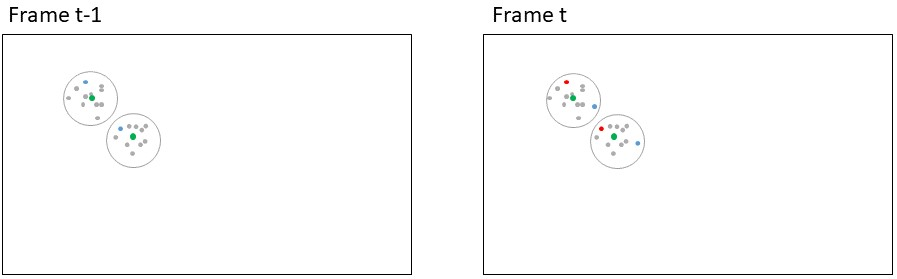
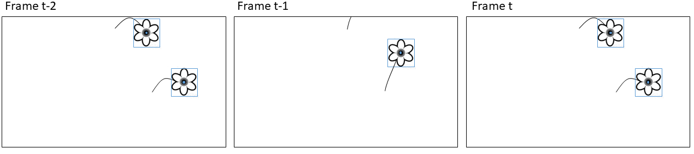

```{r eval = FALSE, echo=FALSE}
library(knitr)
knit('ManuscriptDraft.Rmd')
rmarkdown::render("ManuscriptDraft.Rmd", output_file = "ManuscriptDraft.docx")
system2("open","ManuscriptDraft.docx")
```
\newpage

# Introduction

For the individual plant, timing of flowering is of utmost importance. Precocious flowering means that the plant has failed to exploit the whole temporal window for accumulating resources before allocating energy to flowering. On the other hand, flowering too late limit the time for reproduction before the end of the growing season [@ELZINGA2007]. Further, flowering may need to be synchronous with pollinator activity for successful reproduction. Flowering phenology may plastically change as a response to abiotic cues in the environment, such as timing of spring, temperature, and photoperiod, but variation in flowering phenology is partly heritable and shaped by selective forces from the abiotic and biotic environment.

Monitoring of flower phenology at high temporal resolution is laboursome and time-consuming, particularly in logistically challenging environment such as the Arctic. Consequently, simple variables are often used as proxies for the flowering phenology of a population, such as the date for onset of flowering, often derived from weekly observations of sample plots. Such proxies may fail to reveal dynamics in flowering phenology for example caused by changes in climate.

Automatic image-based monitoring of flowering phenology can return phenology data for specific species at very high temporal resolution (Mann et al., in prep), but phenological responses at the individual level may be indiscernible regardless of the temporal resolution of the data at population level. For example, a shortening of individual flower longevity may not be directly obvious at the population level. Many research questions can only be explored on the basis of individual phenology data. For example, investigating the association between reproductive success and timing of flowering and flower longevity requires phenology data at the level of individuals. Similarly, such data is necessary for investigating whether flower visitation rates and/or reproductive success depends on the timing of flowering for the individual flower.

Here, we show that information on phenology at the level of individuals can be derived from image-based monitoring of flower phenology. Further, we present and evaluate an automatic flower tracking and filtering algorithm. 


Tracking individual flowers enables the possibility of assigning reproductive success to the individual, for example by observation of seed set. Thereby, it can be explored whether reproductive success is affected by timing and length of flowering. By simultaneously tracking flower visits, these could be assigned to the individual flower and visitation rates per flower could be calculated per flower and related to reproductive success. Further, any information of taxonomic grouping could refine this analyses.


For complex scenes with many flowers in close vicinity to each other, we suggest a conservative filtering approach. The approach may remove correct tracks, but the tracks that remain will have a lower risk of tracking errors. The approach allows for more confidence in upscaling the method. E.g., when running the method on a large number of image series, it is preferable to extract individual high-confidence tracks from each series and ignore the remaining tracks.


# Material and methods

## Study site


## The image series


## Flower annotations

The annotation process is described in Mann et al., in prep, but in short: We manually annotated all flowers in the sampled image series using the rectangular bounding box tool in the VIA VGG annotation software. Further, we assigned each individual a unique ID. These annotations constitue our ground truth tracks.


# Automatic tracking

We built a framework for tracking, filtering, and evaluating tracking of objects in time-lapse image series.

Our algorithm tracks objects based on distances between centroids of bounding boxes.


# 
{ width=100% }

**Figure 1:** Simple centroid tracking may produce erroneous associations when objects move between frames. Blue shows detections in the current frame (bounding box and centroid point). Red shows centroid points for the detections in the previous frame.


# 
{width=100%}

**Figure 2:** Simple centroid tracking may produce erroneous associations when objects move between frames. Basing the association on the running mean of the positions of the previous n number of tracks may alleviate this issue. In this case basing the association on only the previous point would produce a wrong results while basing it on the running mean would produce a correct result. Red points: Centroids for bounding boxes in current frame, blue points: Centroids for bounding boxes in previous frame; grey points: Centroids for bounding boxes in a number of frames before t-1; green points: Running mean of the previous n points. Circles delimit the two individuals.

# 
{ width=100% }

**Figure 3:** Simple centroid tracking may produce erroneous associations when objects disappear periodically from the frame. Here the top flower moves out of frame and the bottom flower would be assigned to the track of the top flower in frame t-1.


## User parameters

The tracking algorithm has a set of user adjusted parameters that can optimize tracking accuracy. The parameters are particularly relevant for optimal tracking of objects that are constrained to a specific area such as flowers. It is important to note, however, that the tracking algorithm can be used to track any objects. The tracking algorithm can be applied both offline (on a set of detections/annotations that have already been produced) or online (real-time tracking frame per frame). The speed of the tracking algorithm depends on the computational power available as well as the number of objects that are being tracked. The method is fast, however. Tracking of a series containing 85 objects ran at 0.02 seconds per frame.


As the wind shifts, the flower heads changes direction. This can happen instantaneously (i.e. between two consecutive frames). As they are constrained by their stalk, there is a limit to the distance they can move.

Establishing associations between points based on just the distance between points in the current and the previous frame can cause errors when flowers are in close vicinity of each other.

The flowers move around a center point because of their stalk. We base the tracking on the distance between a point in the current frame and the running mean of the positions of the previous X points in a track.

As winds shift, flowers close to the edge of the frame may move in and out of view. If a flower reappears in the same area as a flower is already being tracked after disappearing in a few frames, it is a reasonable assumption that it is the same individual and not that the old flower wilted/disappeared and a new one developed. The parameter **max disappeared** sets the number of frames a track can be lost before a new track is initiated for points appearing in the same area.

Similarly, this deals with potential false negatives. If a given flower has not been annotated in a single frame, it should not be assigned a new track.

Setting **max disappeared** to 0 tracks objects based on the coordinates of the points in only the previous frame. The counter for number of disappeared frames is reset when a new point is associated with the track within the threshold.


### Identifying optimal user parameters


To estimate the optimal values for max_disappeared and max_distance, we analysed the ground truth tracks of the four series.

To estimate the value for max_distance, we calculated the largest distance between any two points within any track for any flower in each of the four series. 

The maximum number of frames a flower track was lost and subsequently reappeared were xxx. 


To explore the effect of the user parameters and to identify the optimal combination of parameters for our case of tracking flowers, we followed a step wise approach. First, we ran the tracking algorithm on each of the four image series with every combination of the following settings (3.179 combinations):

max_disappeared = [0,10,20,30,40,50,60,70,80,90,100,110,120,130,140,150,160]

running_mean_threshold = [0,10,20,30,40,50,60,70,80,90,100,110,120,130,140,150,160]

max_distance = [0, 100, 200, 300, 400, 500, 600, 700, 800, 900, 1000]

Note that max_distance set to zero. We identified the setting(s) that returned the lowest number of track mismatches and performed a second run with finer scaled settings for each series. Finally, we compare the tracking results between optimal settings and all parameters set to zero.


Depending on the nature of the objects being tracked and the complexity of the scene, the user parameters can be estimated from visual examination of the tracking results. Often it may be preferable to manually annotate a subset of the objects in the image series and derive a set of user parameters from these results.


# Evaluating tracking perfomance

The optimal way of quantifying tracking performance depends on the goal of the tracking. To associate other information obtained in the images to the individual flower, for example flower visits, we want as much as possible of the track to be correct. To derive flowering length in theory we just need to track the most extreme points correctly and don't care about the intermediate points. Lastly, we may be interested in the number of flowers that existed in a plot, in which case we want the number of tracks obtained by automatic tracking to be as close as possible to the actual number of individuals in the series.


The multiple object tracking accuracy (MOTA) score quantifies tracking performance based on counts of tracking mismatches [@bernardin2008]. Mismatches occur when objects swap track identity because they are in close vicinity to each other or when an object periodically disappears and is assigned a new track identity when it reappears. Only the shifts in tracking identity are counted as mismatches while the number of points assigned to each track is not considered.

For each series, we calculate the ratio of flowers for which the automatic tracking algorithm returns the correct flowering length compared to the ground truth tracks.

Finally, we compare the number of tracks identified by the automatic tracking with the true number of flowers in a series. These should ideally be equal.


## Filtering tracks

When deploying the automatic tracking algorithm on naive data without ground truth tracks, it is not possible to manually filter for correct tracks. Therefore, we present a conservative filtering method that extracts the most trustworthy tracks from a scene. 


We disregard single points that were not associated to a track. For tracks consisting of two points, we establish the straight line between the points. For tracks consisting of three points, we establish the triangle from the points. For tracks consisting of more than three points, we calculate the convex hull of all the points included in the track and derive the polygon from the vertices of the convex hull.


We then apply the DBSCAN clustering algorithm on these track geometrics to remove tracks in areas with a high density of tracks as these have a high risk of tracking mismatches. Second, we filter overlapping tracks using the following approach.

We could compare number of points in the overlapping tracks. If one is less than e.g. 10% of the other, we'll remove the small track. If more than 10% we'll remove both?


We then check if any two lines intersect (for tracks with two points), if any lines intersect with any polygons, and if any polygons overlap with other polygons, and remove tracks that overlap.


From our results we see that erroneous tracks often occur as small sections consisting of only few points within the main tracks.


Therefore, tracks that overlap have significant risk of errors. Overlapping tracks can be caused by a single flower that was erroneously assigned to several tracks, two flowers that were located sufficiently close to each other that there areas overlapped (e.g. when wind moves the flowers around), false positive detections close to a flower. Best case is two flowers that flowered in the same area but were separated by time. Here we will remove overlapping tracks to reduce the risk of error.


We evaluate the accuracy of the remaining tracks.


# Results

One way to plot?: Time on x-axis, gt id on y axis, tr id as colour. This will show mismatches.


# Discussion

All three parameters make a difference.

In cases where we are tracking perfectly with maxDisap = 0, setting it any value will not make a difference. Not quite right. Explore more...


# Acknowledgements


# Data availability

The code that supports the results in this paper will be made openly available at https://github.com/TECOLOGYxyz/FlowerTracking. A publicly available web application can be accessed from the Github repository through which users can run the tracking algorithm on their own data. Raw data as well as the trained flower detection model will be archived on https://zenodo.org/.

\newpage
**NOTES**


* **Flowering phenology**
  + Importance of studying flowering phenology
  + Responses to climate change
  + Phenology of communities, populations, individuals
  + Traditional methods for studying
  + Onset of flowering says little about true distribution
    - Even true distribition of community says little about flowering lengths of individuals and for example how it varies accross the season.
  + Difficult to study at the individual level - requires high temporal resolution and keeping track of individuals
* **Image based monitoring**
  + Automatic, high temporal resolution, remote sites
  + High temporal resolution means that we can annotate individuals and get phenology of the individual

* **Tracking**
  + Offline and online
  + Online often coupled with CNNs that attempt to distinguish individuals from each other and recognize them through frames
  
  + Flowers appear very similar and 
  + Many methods for offline tracking
  + Hungarian/Kahlmann filter
  ++ May not be applicable for objects that move weirdly, e.g. change directions between frames.
  + Tracking based on distance.
    - Good but has some problems
    - Two points always associated disregarding absolute distance
    - Tracks lost when objects disappear
    - Objects close to each other may swap tracks

* **Our solution**
  + Here we demonstrate a framework for automatic flower tracking and evaluation of tracking performance
  + Ground truth tracks


Tracking Multiple Moving Objects Using Unscented Kalman
Filtering Techniques:
"Kalman filtering (KF) [5] is widely used to track moving objects, with which we
can estimate the velocity and even acceleration of an object with the measurement of its locations.
However, the accuracy of KF is dependent on the assumption of linear motion for any object to be
tracked. If an object takes some abrupt turns, the nonlinear movement cannot be well handled by the
KF framework (due to the linear movement assumption of the design of KF)."
Kalman, R. E. A New Approach to Linear Filtering and Prediction Problems. Journal of Basic
Engineering, 1960(82), pp. 35-45.

\newpage
# References\
  


