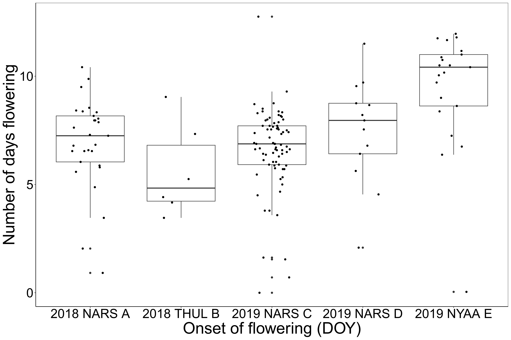

```{r eval = FALSE, echo=FALSE}
library(knitr)
knit('ManuscriptDraft.Rmd')
rmarkdown::render("ManuscriptDraft.Rmd", output_file = "ManuscriptDraft_Resubmission.docx")
system2("open","ManuscriptDraft_Resubmission.docx")
```
```{r echo=FALSE}
# Function for creating word comments in Rmarkdown
# Use: This text contains a `r word_comment("This is the comment", "comment.")`.

word_comment <- function(comment, highlight = "") {
  if (isTRUE(knitr:::pandoc_to() == "docx")) {
    paste0('[', comment, ']{.comment-start id="0" author="Hjalte M."',
           'date="2020-01"}', highlight, '[]{.comment-end id="0"}')
  }
}
```

```{r echo=FALSE}
# Camera codes:
# 2018 NARS-04: 2018 NARS A
# 2018 THUL-01: 2018 THUL B
# 2019 NARS-13: 2019 NARS C
# 2019 NARS-17: 2019 NARS D
# 2019 NYAA-04: 2019 NYAA E

```

Title:

**Towards individual-based floral biology: Automatic tracking of life histories of individual flowers**

# 

Authors:

Hjalte M. R. Mann^1^, Alexandros Iosifidis^2^, Toke T. Høye^1^

# 

Author affiliations:

1: Department of Ecoscience and Arctic Research Centre, Aarhus University, C.F. Møllers Allé 8, 8000 Aarhus C, Denmark\
2: Department of Electrical and Computer Engineering, Aarhus University, Finlandsgade 22, 8200 Aarhus N, Denmark

# 

Corresponding author contact information:

Hjalte Mads Rosenstand Mann\
E-mail: [mann\@ecos.au.dk](mailto:mann@ecos.au.dk){.email}\
Phone: +45 31178585

# 

ORCID IDs:

HMRM: 0000-0002-4768-4767, AI: 0000-0003-4807-1345, TTH: 0000-0001-5387-3284

# 

Keywords: Arctic, *Dryas octopetala*, *Dryas integrifolia*, ecological monitoring, flowering phenology, life-history variation, tracking

#

Word count: 
Article type: Research article

\newpage

# Abstract

 1. A fundamental challenge in pollination ecology is to understand how successful pollination is affected by the timing of flowering, the timing and frequency of pollinator visits, and the abundance and diversity of visitors. Since plant-pollinator interactions concern individual flowers, deciphering the consequences of e.g. shifts in the frequency of flower visits for plant reproductive success should ideally be based on observations of individual flowers throughout their entire flowering period. Due to the overwhelming logistical challenge of collecting such data by direct observation, it has rarely been done.
 
 2. Here, we show that image-based monitoring of field plots at very high temporal resolution can return information on flowering phenology at the level of individual flowers. Further, we present a framework for automatic tracking of flowers in time-lapse image series, evaluating tracking accuracy, and identifying unreliable tracks.
 
 3. Our results on individual floral phenology suggest that traditional weekly observations of flower plots are insufficient to capture details in flowering dynamics. We show that the results of our automated method are reliable by comparing with manual tracking of individual floral phenology.
 
 4. Our method can facilitate fine-grained studies on floral phenology and could be an important tool for estimating the sensitivity of plant-pollinator interactions to climate change.
 
 

\newpage

# Introduction

The Arctic is characterized by short growing seasons and for the individual plant, timing of flowering is of critical importance. Flowering too early increases the risk of frost damage to flowers, while flowering too late limits the time for seed maturation and dispersal before the end of the growing season [@pardee2019; @ELZINGA2007; @inouye2008; @iler2021]. Further, for insect-pollinated plants, flowering must be synchronous with pollinator activity for successful reproduction. Both flower and insect phenology is partly driven by abiotic cues such as snowmelt and temperature and can thus be sensitive to climate change. Changes in floral phenology as a consequence of climate change may indirectly affect the abundance of flower-dependent insect species [@hoye2013] and these effects can be stronger than the direct effects of climate change [@ogilvie2017]. However, the relation between floral phenology and reproductive success is not well understood. For example, @bolmgren2015 found that for an insect-pollinated plant species, early flowering was associated with increased fruit-set but late flowering was associated with higher seed mass. If we are to understand the intricate dynamics of plant-pollinator interactions, tools that aid efficient and comprehensive data collection are essential.

Monitoring floral phenology at high temporal resolution is time-consuming, particularly in logistically challenging environments such as the Arctic. Consequently, flowering phenology of a population is often characterized simply by the date for onset of flowering, typically derived from weekly observations in permanent plots [@Prevey2021]. Such crude estimates may fail to reveal important seasonal dynamics in flowering phenology.. For example, different phenological factors, such as onset, peak, and end of flowering may respond differently to climate change [@cook2012] and estimation of the degree of mismatch between species may thus be sensitive to the choice of metric [@inouye2019]. The optimal metric for phenology depends on the research question, but often the choice of recording first flowering dates to represent flowering phenology is pragmatic rather than ideal. In fact, first flowering dates may be particularly ill suited for estimating sensitivity to climate change since they represent the very extreme of the phenological distribution of a population and may be confounded with e.g. the size of the population considered [@miller2008]. An accurate estimate of the phenological distribution of a population over the full season would allow for, for example, accurate quantification of resource availability through the season and temporal mismatches between species [@ramakers2020]. However, even detailed information on phenology of a population is still an aggregation of the phenology of the individual members of the population for which important variation may be masked [@inouye2019]. With individual level floral phenology it is possible to extract relevant characteristics of the distribution and test their individual sensitivities towards environmental factors, but acquiring such data requires efficient and automated methods.

Cameras have become an ubiquitous tool for non-invasive and efficient monitoring of natural processes [@howe2017; @glover2019], but the implementation of image-based data collection has outpaced the development of methods for processing and analysing the big data output [@weinstein2018; @farley2018]. Gradually, computer vision and deep learning tools are being developed and applied for automatic extraction of relevant data from images [@willi2019; @tabak2019; @hoye2021]. Indeed, automatic image-based monitoring of flowering phenology coupled with deep learning has facilitated collection of phenology data for specific species at very high temporal resolution [@mann2022]. While automated detection and counting of flowers in image-series, as demonstrated in @mann2022, can produce detailed information about floral biology, phenological responses at the level of individual flowers may be indiscernible regardless of the temporal resolution of the data at population level. For example, a shortening of individual flower longevity may not be directly obvious at the population level. In fact, many research questions can only be directly explored on the basis of individual level floral phenology data and such information is critical for investigating the association between reproductive success and timing of flowering and/or flower longevity. Individual level data would also aid the understanding of whether flower visitation rates and/or seed set depends on the timing of flowering for the individual flower. Thus, automated recording of floral phenology by tracking the presence of individual flowers in image-series of permanent plots would be ideal and the feasibility of this as a step subsequent of flower detection was explored in this study.


![Figure 1: Tracking individual flowers through time. A: A time-lapse sequence of five frames showing presence of five individual flowers a (orange), b (purple), c (blue), d (black), and e (green). Flower a is present in all frames, while the other flowers are only present in part of the sequence and/or have gaps in their presence e.g. because of occlusion or because they have temporarily disappeared from frame of view. Correct tracking of individual flowers results in information about the distribution of each individual flower in space (B) and time (C).](../figures/flowertrackingOverview.png){width="30%"}


Most multiple object tracking (MOT) methods focus on tracking of humans [@luo2021; @milan2016], and are not necessarily directly transferable to other use cases. Many tracking algorithms, such as the Simple online and real-time tracking (SORT) [@sort], rely on Kalmann filtering to predict the future location of an object based on its previous velocity [@kalmann]. However, Kalman filtering assumes linear object motion and does not handle abrupt movement well. Flowers are constrained in movement by their stalk and violate this assumption. Other tracking approaches, such as DeepSORT [@deepsort2017], use tracking-by-detection in which convolutional neural networks (CNNs) are applied to continuously distinguish individuals through time, thus aiding the tracking algorithm. Individual flowers, however, are unlikely to be clearly distinguishable and one flower may look less alike between two frames than two flowers in a single frame, which prevents this approach. Finally, some algorithms require manual initiation of a fixed number of tracks in the first frame and do not allow objects to enter or disappear during tracking [@hu2012]. In full-season monitoring data, flowers should continuously be tracked as they bolt and wilt throughout the season Additionally, a flower tracking method must handle flowers disappearing and appearing at the edges of the frame. Clearly, individual flower tracking is a challenging task.

Here, we present and evaluate a simple MOT algorithm for automatic tracking of individual flowers in image-series. Our tracking algorithm is based on centroid tracking and assigns objects to tracks based on the minimum distance between centroids of bounding boxes, and allows initiation and termination of tracks during tracking. We describe three user-defined parameters incorporated into the algorithm, demonstrate their effect on simulated data, and discuss their applicability in flower tracking. For complex scenes with many flowers in close vicinity to each other, there is an increased risk of tracking errors regardless of the tracking method being used. For such cases, we suggest a conservative filtering approach based on the distance between flower tracks within the frame in order to identify tracks that are sufficiently spatially isolated and likely to be tracked with certainty. We apply the algorithm on annotations of real flowers in time-lapse image-series from full-season monitoring of two widespread Arctic flowering plant species *Dryas integrifolia* and *D. octopetala*. Overall, we show that information on floral biology can be automatically derived from image-based flower plot monitoring.


# Material and methods

## Common tracking errors and evaluating tracking performance

In MOT, two fundamental errors can occur. First, a single trajectory may be split into several tracks, an error known as fragmentation. This can happen when an object is temporarily occluded or have disappeared from view and a new track is erroneously initiated when it reappears, or when identity shifts occur between tracks, for example when they switch positions between frames. Fragmentation is especially prone in settings with high densities of objects. Second, merging occurs when several trajectories are assigned the same track identity. This can occur when a track is not correctly terminated at the end of a trajectory but rather continues on the trajectory of another object. Here, importantly, the two individual trajectories can be tracked without internal errors (i.e. without mismatches).


The optimal approach for quantification of tracking performance depends on the goal of the tracking. For example, in our case of tracking flowers, associating information obtained in the images to the individual flower, for example flower visits, would require the track to be as correct as possible (i.e., identity shifts should be minimized). On the other hand, to derive flowering length in practice just requires correct association between the first and the last image of a flower while intermediate points can be ignored. Here, track fragmentation can lead to underestimation of flowering duration (and overestimation of number of flowers) while track merging can lead to overestimation of flowering duration (and underestimation of number of flowers). In some scenarios, one may be interested in the number of individual flowers that existed in a plot, in which case the number of tracks obtained by automatic tracking should closely resemble the actual number of individuals in the series.

Here, we apply the commonly used MOT accuracy score (MOTA) which quantifies tracking performance based on tracking mismatches derived by counting the number of identity shifts within each track [@bernardin2008]. Only shifts in tracking identity are counted as mismatches in the MOTA score, while the number of points assigned to each track is not considered.

$$
MOTA = 1 -  \frac{\sum{_t(fn_t + fp_t + mm_t)}}{\sum{_tg_t}},
$$

where fn, fp, and mm are the number of false negatives, false positives, and track mismatches, respectively, for frame t divided by the total number of ground truth annotations across all frames. The MOTA score ranges from -Inf to 1, with 1 being perfect detection and tracking. In our case, we can ignore the variables false positives and false negatives, as we are tracking on manually annotated tracks that are considered the ground truth.

To evaluate tracking accuracy of our algorithm, we calculate the total number of mismatches as well as the MOTA score (number of mismatches in relation to the total number of points). Additionally, we derive the number of tracks that were tracked with more than 80% accuracy. Finally, we compare the number of tracks identified by the automatic tracking with the true number of flowers in a series. These should ideally be equal. However, we note that a correct number of tracks (i.e., number of tracks equal to number of objects) does not necessarily translate to correct tracking, since single tracks can be erroneously fragmented simultaneously with merging of multiple tracks. We present the tracking performance without the use of the three tracking parameters along with the best performance (lowest number of mismatches/highest MOTA), and the best performance where the number of tracks correspond to the number of individual flowers in the series.


## Simulated data

To demonstrate our tracking algorithm and the effect of the three parameters, we used simulated data mimicking flower detections.To produce simulated detections of a flower, we defined a circle with radius rF and center point cF to delimit the boundaries of the flower. The first data point for the flower was then generated as a random point within this circle. Then, remaining data points (i.e. data points for the subsequent frames) were generated iteratively with each new point being constrained to be within a circle with a center point of the position of the previously generated point and a radius rM, as well as limited to be within the boundaries of the flower. This approach allowed us to simulate specific scenarios on which to demonstrate our algorithm by controlling the number of flowers generated, their positions and boundaries, the number of data points produced per flower, and the degree of movement between frames (i.e. the maximum distance between current and next point).

We generated four data sets (Fig. 2) to demonstrate each tracking parameter as well as the influence of frame rate on tracking reliability. In simulation A (Fig. 2A), we produced two flowers that are spatially distinct and temporally separated (i.e., one flower appears subsequent of the other). Each flower consists of ten data points and thus the data set spans over 20 frames. In simulation B, we produced four flowers that are spatially separated. Each flower consists of 5 data points, but the data set spans over 10 frames and each flower contains random gaps of 1-3 data points. In simulation C, we produced four flowers that are in close proximity to each other and with a large degree of movement between frames. Each flower consists of 500 data points and the data set spans over 500 frames. Finally, in simulation D, we produced four flowers with very high number of data points (10,000 per flower) but with only little movement between frames. Here, we used the same center point (cF) for all four flowers to increase overlap. Two pairs of flowers have a high degree of spatial overlap.


For each of the simulations, we present the tracking performance of our algorithm without the use of the three parameters and subsequently show how the parameters can be used to mitigate various challenges in the data and increase tracking accuracy. The two objects in simulation A are adjacent in time but spatially separated. We therefore introduce a limit to the spatial distance that is accepted between points in adjacent frames before they are considered unique objects. We do that with the max distance parameter. The objects in simulation B overlap in time but are well separated in space. However, each track contains gaps which can lead to track fragmentation. To allow gaps in track, we set a number of frames that a track can disappear before initiating a new track for points appearing in the same location. In simulation c, each object is allowed to move a lot between frames. Each object has a large spread of points and the four objects are in close proximity to each other. This means that between two frames, there is a substantial risk that a point for one object is closer to a point from another object rather than the point for that object, which will lead to identity shifts. To mitigate this, we calculate displacements based on the current point and a set number of previous points in a track using the running mean parameter. This reduces the weighting on the displacement between the current and the previous point. Finally, in simulation D, we have four objects that overlap in pairs of two, but with little movement between frame. Therefore, a point from a given object is likely to be closest to the point from the same object in the previous frame. Effectively, while the overlap is substantial, the frame rate is sufficiently high that accurate tracking is ensured. To demonstrate the importance of frame rate for reliable tracking, we simulate a reduction in frame rate (i.e., increased degree of movement between frames) by basing tracking on every 10th, 20th, and 30th frame, respectively.


![Figure 2: Simulated flower detection data to demonstrate the tracking algorithm and the effect of the three tracking parameters, max distance, max gap, and running mean (refer to Automatic flower tracking section for definitions), as well as the significance of frame rate for reliable tracking. A: 10 points per flower, rF (radius of circle delimiting flower points) = 200, rM (radius of circles delimiting distance between consecutive points) = 100. Arrow shows the last point of flower a and the first point of flower b. B: 10 points per flower, rF = 200, rM = 100. C: 500 points per flower, rF = 200, rM = 200. D: 10,000 points per flower, rF = 100, rM = 1.](../figures/simulatedData.png){width="30%"}


## Flower data


### Study site and species

This study is based on five full-season time-lapse image series collected at the following three Arctic sites (site abbreviation and sampling years in parentheses): Narsarsuaq (NARS), South Greenland (2018, 2019), Thule (THUL), North-West Greenland (2018), Ny-Ålesund (NYAA), Svalbard (2019). The images were captured using time-lapse cameras (Moultrie Wingscapes TimelapseCam Pro, Moultrie Products, Birmingham Alabama, USA) permanently positioned approx. 60 cm above areas with either *D. integrifolia* in Narsarsuaq and Thule or *D. octopetala* in Ny-Ålesund. The white flowers of these two species are insect-pollinated and held erect above cushions of foliage. The species are native to and widespread in Asian, North American, and European Arctic and alpine regions. They are geographically separated except for a possible hybrid zone in North-East Greenland [@philipp2003].


### The image series and flower annotations

Images were collected throughout the full growing seasons. While the original time-lapse frequency was higher, the basis for this study was 1-hour interval series. We limited these series to include only the flowering season and, to limit the workload for manual annotation, randomly sampled images from each series. The number of images for each series after sampling is given in Table 1. All flowers in bloom within each of these image were manually annotated using the rectangular bounding box tool in the VIA VGG annotation software [@dutta2019] and each individual flower was assigned a unique ID that was maintained throughout its lifetime. These annotations constitute our ground truth tracks. The series varied substantially in the number of flowers they contained (Table 1). Examples of annotated images from the 2019 NARS C series at three different times in the flowering season are given in figure 3. To demonstrate how individual flower tracking can result in detailed representations of floral phenology across the season, we use the ground truth annotations to show the variation in duration of flowering for each series.


# 
{width="40%"}

# 

{width="20%"}

### Automatic flower tracking

We present a framework for tracking, filtering, and evaluating tracking of objects in time-lapse image series. The tracking algorithm (suppl. 1) is based on centroid tracking [@rahman2020; @bjerge2021]. That is, objects with minimum displacement between frames are associated. Centroids are derived from bounding boxes around objects stemming from manual annotation or automatic detection of objects. Thus, the input data for the tracking algorithm are bounding box coordinates (top left corner and bottom right corner) for each object [@everingham2010]. The algorithm has a set of user-adjusted parameters that can optimize tracking accuracy. The parameters are particularly relevant for tracking of objects that are constrained to a specific area such as flowers. 

Several issues complicate the task of tracking individual flowers through time-lapse image series. First, as flowers move, they may temporarily occlude the view of other flowers and flowers close to the edge of the frame may move in and out of view between images. This can cause a track to be lost and fragmentation to occur (Fig. 4A). However, if a flower reappears shortly after having disappeared from view, it is a reasonable assumption that it is the same individual. The parameter **max gap** sets the number of frames a flower can be absent before reappearing without triggering track termination and initiation of a new track. Concurrently, the parameter can prevent track termination owing to false negatives.

Second, a standard centroid tracking algorithm will associate a point with a track based on minimum distance only, disregarding the absolute distance between centroids, which may lead to tracking errors (Fig. 4B). However, as flowers are constrained in their displacement, we can assume a maximum distance between points and force the initiation of tracks for points that exceed this threshold. We set this threshold with the parameter **max distance,** measured as the euclidean distance in number of pixels between objects in neighboring frames.

Third, reliable tracking based on distance requires that movement of individuals are captured at sufficient frequency to prevent identity shifts. Stand-alone image-based monitoring of the relatively slow process of flower development through full growing seasons (several months) is likely to be done with low frame rate, limited by power consumption and storage capacity both on and off the camera. Here, we used several images per day and while this temporal resolution captures the phenology of the flowers at very high detail, they fail to capture the full movement of flowers. For example, as the wind shifts, the flower heads change direction, which in the image series happens instantaneously (i.e., between two consecutive frames) (Fig. 4C). The fact that the frame rate is insufficient to capture smooth movement means that bounding boxes around a single individual in two consecutive frames cannot be associated based on overlap (e.g. intersection over union) as there often is no overlap. With a high number of flowers in close vicinity to each other, there is a substantial risk of identity shifts between flowers (Fig. 1C;4C). Additionally, as the flowers are constrained by their stalk, there is a limit to the distance they can move, which prevents prediction of future location of an individual based on its previous trajectory. Here, we use the tracking parameter **running mean**, with which we can base tracking on the distance between a point in the current frame and the running mean of the positions of a number of previous points in a track, taking advantage of the fact that a flower moves around a central point. Increasing the value for this parameter decreases the weighting of movement between individual frames. Setting the parameter to 1 means that tracking is based on the distance to the centroid in the previous frame only.


# 


![Figure 4: Centroid tracking may produce erroneous associations when objects move or disappear between frames. A: A track may be lost when a flower temporarily disappears from view. If gaps in tracks are not allowed during tracking, a new track will erroneously be initiated when the flower reappears. B: A flower may be linked to an incorrect track despite large distance between them. Here, a flower disappears from view and another reappears between two frames. If no threshold for maximum distance between an object and a track is set, the reappearing flower will be linked to the track of the disappearing flower based on shortest distance despite the absolute distance being large. C: A flower may be linked to an incorrect track despite shortest distance to the running mean of the correct track. As flowers move around a central point, it is relevant to base tracking on a running mean of previous positions. Dots show position of flower in previous frame. Crosses show running mean of positions in x \> 1 number of previous frames. Flowers, dots and crosses coloured according to identity.](../figures/errorFigure.png){width="100%"}


#### Testing the use of the tracking parameters

To explore the effect of the three tracking parameters and to identify the optimal combination of parameters for our use-case of tracking flowers, we applied the tracking algorithm on each of the five image series with every combination of a range of values for each parameter (3179 combinations): 0-160 with a step size of 10 for max gap; 1-160 with a step size of 10 for running mean; 0-1000 with a step size of 100 for max distance. Note that max distance set to zero ignores the parameter altogether. We present the tracking accuracies for three different scenarios: Parameters zeroed (PZ) (Max gap = 0; Max distance = 0; Running mean = 1) (hereafter referred to as naive tracking), minimum number of mismatches achieved, and minimum number of mismatches achieved with a number of tracks equal to the number of flowers in the series.


### Identifying the most reliably tracked flowers


With the substantial variation in number of flowers per series as well as distances between flowers, it is likely that some can tracked with certainty or near-certainty while others, especially flowers in close proximity to each other, will prove challenging. To facilitate identification of the most reliably tracked flowers in a series without the need for manual annotation, we use a conservative filtering method that extracts the most trustworthy tracks from a scene based on spatial distance between tracks. We derive the distance between tracks based on the centroids of points included in a track. When tracks consist of only a single point, the coordinates of the point is used as the centroid. For tracks consisting of two points we use the midpoint of the line between them. For tracks consisting of three points or more, we calculate the convex hull of all the points included in the track and use the centroid of this polygon. For the special case where a track contains more than two points but where the points are collinear (i.e., lie on a single straight line), we use the midpoint of the line through the points. We hereafter refer to these centroids as track centroids.

The filtering is done on the centroids to remove tracks in close vicinity to each other as these are assumed to have a high risk of tracking mismatches. The distances between all track centroids are calculated (euclidean distance in number of pixels) and only tracks that have no neighboring track centroid within the filtering distance threshold are kept. We demonstrate the filtering method on the three series for which our tracking algorithm did not return perfect results (i.e., automatic tracking identical to ground truth tracks). To test the filtering approach, we chose a fixed combination of the tracking algorithm parameters across all three series (max gap size: 10; running mean: 10; max distance: 300). We then applied the filtering method on each three series with a range of values for the filtering distance (50-500, step size of 50) and identified the value that returned the highest sum of tracks across the three series at zero mismatches. We present the tracking accuracy before filtering and on the remaining tracks after filtering. We emphasize that our results are conservative and that the approach may be optimised to extract a higher number of tracks while maintaining the number of mismatches, for example by basing the filtering on the optimal tracking results for each series or by fine-tuning the filtering distance threshold for each series. As our goal here was to demonstrate that our tracking and filtering method can be applied in a naive setting with fixed values for each parameter, we have not included those results.


# Results

## Simulated data

Naive tracking for simulation A resulted in a merging error (i.e. the two objects were tracked as one). A max distance value of 200 removed this error and resulted in perfect tracking of the two objects. Naive tracking for simulation B returned eight tracks and nine mismatches (MOTA = 0.55). Setting max gap to 4 decreased the number of mismatches to four (4 tracks, MOTA = 0.8) and including a value of 200 for max distance as for simulation A removed the remaining errors and resulted in perfect tracking. For simulation C, naive tracking returned the correct number of tracks (4), but 38 mismatches were made (MOTA = 0.98). Setting the running mean parameter to 20, 40, 60, resulted in 16, 8, and 4 mismatches, respectively, while a running mean value of 80 resulted in perfect tracking. A running mean value of 100 resulted in 4 mismatches. For simulation D, the algorithm tracked the four objects perfectly despite substantial overlap, while tracking on every 10th, 20th, and 30th frame resulted in 2, 4, and 10 mismatches, respectively.

## Flowers
Manual tracking of individual flowers derived from image-based plot monitoring enabled detailed information on floral phenology at the level of individuals with substantial variation in flowering duration between flowers (Fig. 5). Our tracking algorithm was able to track individual flowers with consistently high accuracy (MOTA $\geq$ 0.981) across all series. In all cases, all flowers were tracked with more than 80% accuracy (Table 2) and two series were tracked without errors (2018 THUL B and 2018 NARS D). Naive tracking returned high MOTA scores across series, but for all three series that were not tracked perfectly, utilizing the tracking parameters increased the MOTA score.

Importantly, the tracking that returned the lowest number of mismatches did not necessarily result in a number of tracks equal to the number of flowers in a plot. For example, for the series with the most flowers, 2019 NARS C, one combination of parameters (max gap = 20, max distance = 600, running mean = 1), returned the lowest number of mismatches (31), but the number of tracks were lower than the actual number of flowers (71 vs. 85). One paramereter combination did return a number of tracks equal to number of flowers (max gap = 10, max distance 400, running mean = 10), but also increased the number of mismatches to 91. For 2019 NARS D, several combinations of parameters returned a perfect MOTA score, but still some combinations returned a number of tracks lower than the number of flowers. This demonstrates the significance of merging errors, which are not accounted for in the MOTA score. In figure 6, we exemplify the two types of errors, identity shifts and merges, in the flower data.


{width="100%"}


![Table 2: Tracking performance for the automatic flower tracking algorithm for different tracking parameter combinations. Number of tracks in bold signifies a number of tracks equal to the number of flowers in the series. Tracking performance is shown for three different tracking settings: Parameters zeroed (PZ) (Max gap = 0; Max distance = 0; Running mean = 1), minimum number of mismatches achieved (MM), and minimum number of mismatches achieved with a number of tracks equal to the number of flowers in the seris (CF MM). The last type is not given if the results were equal too those for MM. When several parameter combinations returned the same results, the range of parameter values included is given.](../figures/tab_1.png){width="100%"}


![Figure 6: Tracking results of three flowers in the 2018 NARS A image series. A: Track output from the flower tracking algorithm for three individual flowers using two different combinations of tracking parameters. The y-axis shows the correct track IDs assigned by manual tracking. Each track is coloured by the IDs assigned by the flower tracking algorithm. The top panel (max gap = 10, running mean = 1, max distance = 0) shows a merging error of flower 15 and 28 (see B), while flower 25 has been fragmented into two separate tracks causing one mismatch (see C). The bottom panel show correct tracking output returned when using the parameters max gap = 10, running mean = 20, max distance = 50. B: Merging error between two tracks. Frame f shows the last frame containing flower 15 (blue). Two frames (5 hours) later (f+2), flower 28 (blue) has  bolted. Since max gap \> 2 and no distance threshold has been set, flower 28 is associated with the track of flower 15. Setting a max distance threshold to 500 fixed this error as illustrated in A. C: Displacement of flowers 25 and 29 between two frames, f and f+1, (7 hours apart), causes an identity shift. Setting running mean to 20 fixed this error as illustrated in A.](../figures/errorExamples.png){width="100%"}


With our filtering method, we were able to identify 28 tracks with no mismatches from the three series (2018 NARS A: 15 tracks; 2019 NARS C: 10 tracks; 2019 NYAA E: 3 tracks) with complex scenes using a fixed filtering distance value of 350 and fixed values for the tracking parameters (suppl. 2). The results of the filtering algorithm on the three series are given in Table 3 and the filtering process is visualised in figure 7.


**Table 3:** Results of the filtering algorithm on tracking results using the parameters max gap = 10, max distance = 300, running mean =  10. The filtering distance value of 350 was used for all three series.

{width="100%"}

# 

![Figure 7: The track filtering process exemplified by the 2019 NARS C series. A: The centroid points for all bounding boxes in the series, coloured by the track id from the centroid tracking algorithm. B: The track convex hull polygons calculated from the tracks. Polygons are coloured according to group and polygons with a euclidean distance below 350 between them have been grouped together. C: The results of the filtering where all tracks that were not sufficiently spatially isolated have been removed, resulting in 10 remaining tracks without tracking errors.](images/filterFigLet.png)


# Discussion

## Tracking

In this paper, we have demonstrated the potential of automated tracking to monitor floral phenology of individual flowers from bolting to withing and produce new insight into floral biology. We have presented a simple distance-based tracking algorithm and, with simulated data, we have shown how tracking parameters can be used to tune the tracking algorithm to deal with specific challenges and increase tracking performance. We have tested our method on real flower and demonstrated the feasibility of tracking individual flowers in images through time. Challenges similar to the ones demonstrated through simulations existed in the real flower data and adjustment of the tracking parameters allowed for increased tracking accuracy of the real flowers.

The automatic tracking and filtering pipeline presented was able to return reliable flower tracks despite complex scenes with a high number of objects with sporadic visibility and violation of standard tracking algorithm assumptions. Even with simple centroid tracking where association is based solely on displacement between the current and previous frame, tracking performances were high for all flower series and perfect for two. Further, coupling this the user-defined tracking parameters and our filtering approach, we were able to optimize tracking performance and extract reliable tracks.

The two series for which the tracking algorithm produced perfect results were also the series with the lowest number of flowers. While an increased number of objects does not necessarily increase tracking difficulty as this depends on the degree of isolation of tracks in time and space [@beard2018], here, since the flowers are limited in space and time, the complexity of tracking is likely to increase with higher numbers of flowers as this increases the possibility of flowers overlapping or moving in and out of frame. The high complexity in the scenes with many flowers, especially 2019 NARS C with 85 flowers, coupled with the low frame rate renders it unlikely that any tracking method could produce perfect results across series. Although 2019 NARS C may be considered an extreme case for our application, it underlines the relevance of a pipeline including both tracking and filtering, but also points to the possibility of filtering image series based on an estimate of the number of flowers before automated tracking, which could be relevant in some cases.


Importantly, optimizing for high MOTA can lead to an underestimate of the number of tracks (i.e., merging of tracks occurs) (Table 2). While accepting gaps in tracks allows for temporary occlusion of a flower within a track it may also lead to merging of separate tracks. Flower tracking may be especially prone to these errors since flowers can bolt in the same area at different times during the season. The task of evaluating multiple object tracking accuracy is a challenge in itself [@luiten2020; @milan2013; @milan2016] and other tracking accuracy metrics that account for merging errors in a better way should be further studied.

The optimal settings for the three tracking parameters fell into a narrow range for the three complex series, except for the running mean for 2019 NYAA E, which were exceptionally high compared to the other series. Interestingly, the average flower duration was also higher for this series and this could be part of the explanation, as longer lifespan allow for larger gaps in the tracks. The three series with complex scenes all contain flowers at the edge of the frame that may occasionally be outside the view of the camera (see Fig. 3) and the high number of flowers increase the risk of flowers temporarily occluding others. Correct tracking of these objects requires a max gap setting that optimizes the trade-off between fragmentation and merging errors. Overall, the max gap parameter improved tracking accuracy with values of 10-20 being optimal.

The optimal range for max distance was relatively narrow (400-600) for the parameters producing the correct number of tracks with the lowest number of mismatches. The optimal value for this setting is one that is sufficiently high that it does not force individual flowers into separate tracks because of movement between frames, yet is low enough to separate flowers into individual tracks that would otherwise have been grouped together. This explains why the extreme values for this parameter was not included in the highest accuracy tracks.

It is important to note that the tracking parameters are not independent. For example, changing the setting for running mean could influence the optimal value for max distance. This underlines the relevance of searching for an optimal parameter combination based on ground truth data. As with any tracking method, accuracy can only be assessed based on ground truth data [@dendorfer2021; @luiten2020; @milan2016]. However, the fact that the optimal tracking parameters were overall similar across series strengthens the assumptions that a set of standard values can produce reasonable results for other similar image series with *Dryas* flowers. Here, a combination such as 10, 500, 10, for max gap, max distance, and running mean, respectively, would be a good starting point. When applying our method in a new setting, we recommend performing a parameter test as demonstrated here on a subset of ground truth tracks to derive the optimal set of parameters.

We demonstrated our method on manual annotations of flowers but note that the format of the input data matches the output of deep learning object detection methods [@everingham2010]. Thus, the method can be directly applied on such data, for instance as produced by the method described in @mann2022. Automatic detecting of flowers would likely introduce false negatives when the detection algorithm fails to detect an object, but here the max gap parameter may alleviate such problems. Automatic detection methods may also introduce false positives. These detections would be included in the tracking along with correct detections. Some cases of false positives, for example isolated single false positives, could be removed automatically while other cases may require manual quality control. In general, the performance of a tracking algorithm depends on the quality of input data and it is advisable to optimise detection accuracy before moving to tracking. The fact that our method produced perfect tracking results in the most simple settings (fewest flowers) could be taken into consideration when setting up future data collection schemes.

## Filtering

We presented a filtering method based on the distance between track centroids, which can be applied subsequent of tracking. The filtering algorithm successfully extracted 28 correct tracks from the three series for which the tracking algorithm did not produce perfect results. Extracting tracks that are spatially isolated does not guarantee that the tracks are without errors. For example, tracks of several objects may have been erroneously merged or a track could contain few instances of another object. However, it is reasonable to assume that spatially isolated objects are in general easier to track. We applied the filtering algorithm on tracks produced with a fixed set of tracking parameters as well as a fixed value for the filtering distance. As in the case of the tracking parameters, we recommend setting the value for the filtering distance based on either visual examination of results or on tests on a subset of ground truth data when applying the method in a new setting, but for tracking *Dryas* flowers in similar image series, a value of 350 may be a good starting point. The presented method avoids weighting track geometries based on number of included points and also weighting the centroid coordinate based on the point coordinates within the track as the track centroid is based on the convex hull of the track points. Additionally, it allows for overlap between track geometries as long as the distance between the track centroids is above the threshold. We note, however, that other approaches may be more suitable in other settings and applications.


## Automated monitoring of ecology

Collection of continuous observational ecological data can be a time-consuming task. @Estes2018 argued that as ecologists rely on conventional field techniques, the observational scales of ecological studies are generally narrow and may be insufficient to comprehend the ecological phenomena in focus. Development and implementation of technological tools for ecological data collection can facilitate ecological studies with larger temporal and spatial scopes [@Pimm2015; @allan2018]. For processes that require high and continual temporal observation frequency to monitor, such as tracking individuals and their interactions, automation of data collection is critical, especially in remote places where human access is limited. Here, we have demonstrated the potential of image-based monitoring for collecting information on individual-level floral phenology. Coupling this with automated detection of flowers as demonstrated in @mann2022 permits an automated pipeline for collection of floral biology data.

It is clear that images derived from monitoring of permanent plots can hold substantial amounts of ecologically relevant data. To derive some variables, for example flower visitation rates, image series collected at high temporal frequency is required. As the scale of data increases as well as the number of variables to be extracted from the images increase, automated image analysis becomes critical. Here, methods from deep learning and computer vision are exceedingly relevant. For instance, it has been demonstrated that CNNs can facilitate monitoring of pollination events by detecting, identifying, and counting insects [@bjerge2021] and perform fine-grained species classification [@spiesman2021]. Collectively, these developments coupled with implementation of long-term high-frequency image-based monitoring will allow for collection and processing of ecological data at unprecedented scales [@hoye2021; @besson2022]. By coupling pollinator detection and classification with floral tracking, visitation rates per flower could be derived and the effects on reproductive success could be investigated [@tiusanen2016; @rafferty2012].


The possibility of collecting individual level floral phenology is relevant for many research questions. For example, coupling such information with indicators of seed set could facilitate investigation of the effect of timing and length of flowering and/or abiotic conditions such as frost events on seed set. Hereby, the long-standing question of what drives variation in reproductive success of individual flowers could be explored [@bolmgren2015]. Further, the fact that it was not uncommon in our results that flowering lasted less than a week emphasizes that weekly observations of sample plots can be insufficient for comprehensive description of floral phenology [@Prevey2021].


Pollen limitation is a common factor limiting the reproductive success of flowering plants. However, the ecological mechanisms behind pollen limitation is poorly understood, at least partly because it requires information on plant seed set in relation to pollinator visitation rates which is difficult to acquire in a natural setting and to a satisfactory extent. For example, pollinator visits can vary greatly in frequency during the flowering season and the degree of pollen limitation can vary even between populations in close vicinity to each other [@larson1999; @ashman2004]. High frequency observations of flower visits coupled with information on phenology and reproductive success at the level of individuals could unravel the relationship between pollinator visitation and plant reproductive success and the climate sensitivity of plant-pollinator interactions. Further, any information on taxonomic or functional grouping could facilitate comparative studies on pollination effectiveness between such groups [@king2013; @foldesi2021]. Importantly, the variables suggested here could be derived directly from the time-lapse images. For example, seed set as an indicator of flower reproductive success could be estimated for individual flowers and flower visitation rates could be quantified by detecting insects in flowers in high temporal resolution image series.


Our results emphasize that floral tracking is not a trivial task. The data violate common assumptions of tracking methods and tracking individual flowers through time-lapse images therefore represents a special case [@chen2022; @betke2007; @luo2021]. Since flower movement is constrained, the future location of a flower-head cannot be predicted based on the previous movement trajectory. As individual flowers closely resemble each other, tracking cannot be based on recognition of individuals [@chen2022; @deepsort2017]. Further, flowers have varied lifespans and may have sporadic visibility within the frame. These settings vastly complicate the task of tracking multiple objects [@betke2007]. Our tracking algorithm returned consistently high accuracy despite this, but were unable to reliably track flowers in some cases. To further improve tracking ability of flowers in future studies, focus should be on implementing reliable measures of tracking error and on developing methods that can alleviate the challenges that exist with tracking visually similar objects, as well as on comparison of different tracking approaches. Alongside this, methods for extracting auxiliary information from images, such as flower seed set, should be explored.

Image-based methods facilitate automated data collection a high frequency, across diurnal cycles and throughout seasons, but the extensive amount of data that results from automated data collection also necessitates efficient and automated analysis pipelines. Our results show that it is feasible to collect and analyse individual floral phenology in high detail at logistically challenging sites, which is a significant contribution towards automatic and efficient phenology data collection. Most importantly, adoption of automated methods for data collection and analysis within ecology, and specifically within for example pollination ecology, will transform the extent and scale of studies and the questions that can be explored.


Owing to the limited resolution of the cameras used in the present study, it is unlikley that detailed information about anther opening or pollen release can be recorded from these images, but with increased image quality, this may be possible.


# Acknowledgements

We thank Cecilie Mielec, Michael Straarup Nielsen and Maarten J. J. E. Loonen for set-up and maintenance of cameras in Ny-Ålesund, Peter Akers and Jeffrey M. Welker for set-up and maintenance of cameras in Thule, and Rebekka Ween and Line Klausen for assistance during fieldwork in Narsarsuaq. TTH acknowledges funding from Independent Research Fund Denmark Grant 8021-00423B. The authors have no conflict of interest to declare. Thank you to Adrian Rosebrock (https://pyimagesearch.com/2018/07/23/simple-object-tracking-with-opencv/, accessed on November 29th 2022) for inspiration for the design of the centroid tracking algorithm.


# Author contributions

HRMR, TTH and AI conceived the idea. HMRM conceived and developed the method with contributions from TTH and AI. HMRM wrote all code. HMRM wrote the manuscript with contributions from TTH and AI. All authors gave final approval for publication.

# Data availability

The code and data that supports the results in this paper is openly available at <https://github.com/TECOLOGYxyz/FlowerTracking>.

\newpage

# References
