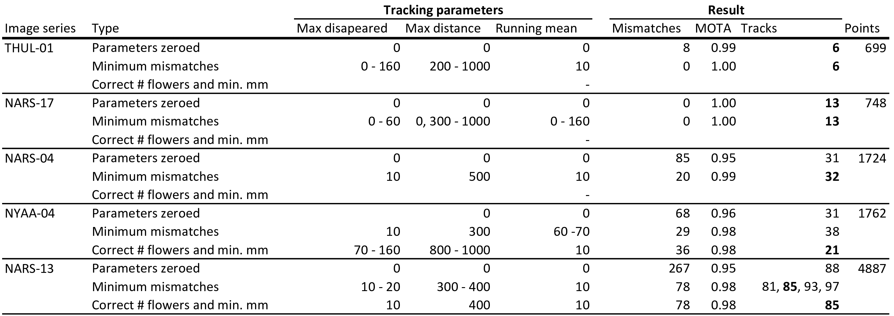
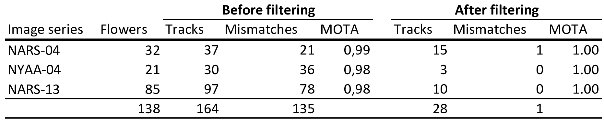

```{r eval = FALSE, echo=FALSE}
library(knitr)
knit('ManuscriptDraft.Rmd')
rmarkdown::render("ManuscriptDraft.Rmd", output_file = "ManuscriptDraft.docx")
system2("open","ManuscriptDraft.docx")
```

```{r echo=FALSE}
# Function for creating word comments in Rmarkdown
# Use: This text contains a `r word_comment("This is the comment", "comment.")`.

word_comment <- function(comment, highlight = "") {
  if (isTRUE(knitr:::pandoc_to() == "docx")) {
    paste0('[', comment, ']{.comment-start id="0" author="Hjalte M."',
           'date="2020-01"}', highlight, '[]{.comment-end id="0"}')
  }
}
```

```{r echo=FALSE}
# Camera codes:
# 2018 NARS-04: 2018 NARS A
# 2018 THUL-01: 2018 THUL B
# 2019 NARS-13: 2019 NARS C
# 2019 NARS-17: 2019 NARS D
# 2019 NYAA-04: 2019 NYAA E

```


\newpage

# Introduction

For the individual plant, timing of flowering is of utmost importance. Precocious flowering means that the plant has failed to exploit the whole temporal window for accumulating resources before allocating energy to flowering. Oppositely, flowering too late limits the time for reproduction before the end of the growing season [@ELZINGA2007]. Both precocious and late flowering increase the risk of frost damage to the flowers. Further, flowering may need to be synchronous with pollinator activity for successful reproduction. Flowering phenology may plastically change in response to abiotic cues in the environment, such as timing of spring, temperature, and photoperiod, but flowering phenology is partly heritable and shaped by selective forces from the abiotic and biotic environment and in any case sensitive to climate change.

Phenology is often studied with first events as proxies for the full phenology distribution of the population . For flowering plants the time of first flowering is used to represent the phenology of a population of plants. The ideal metric for phenology depends on the topic of the question, but often, the choice of onset of flowering as the proxy for phenology is based on data availability and not because it is necessarily considered the ideal metric. First events, such as onset of flowering, may in some cases be particularly ill suited for estimating sensitivity to climate change [@miller2008]. The date for first flowering represents the very extreme of the phenology distribution of a population and may be confounded with e.g. the size of the population considered. Further, for many questions the phenology distribution of a population is required, for example to quantify resource availability through the season. However, even detailed information on phenology at the level of a population is still an aggregation of the phenological distributions of the individual members of the population for which important variation may be masked [@inouye2019]. Having at hand the full distribution of flowering phenology at the level of individuals allows to extract relevant characteristics of the distribution and test their sensitivity towards environmental factors, but acquiring such data requires efficient and preferably automatized methods.


Pollen limitation is a common factor limiting the reproductive success of flowering plants, but the ecological mechanisms behind pollen limitation is poorly understood, at least partly because it requires information on plant reproductive success in relation to pollinator visitation rates which is difficult to acquire in a natural setting and to a satisfactory extent. For example, pollinator visits can vary greatly in frequency during the flowering season and the degree of pollen limitation can vary even between populations in close vicinity to each other [@larson1999; @ashman2004]. A lot remains to be discovered about when and how the dynamics of pollination affects the reproductive success of flowering plants. High frequency observations of flower visits coupled with information on phenology and reproductive success at the level of individuals is required to unravel the relationship between pollinator visitation and plant reproductive success and the sensitivity of this interplay to climate.


Monitoring flower phenology at high temporal resolution is time-consuming, particularly in logistically challenging environments such as the Arctic. Consequently, flowering phenology of a population is often characterized simply by the date for onset of flowering, typically derived from weekly observations of sample plots [@Prevey2021]. Such inaccurate estimates may fail to reveal important dynamics in flowering phenology through the season. Automatic image-based monitoring of flowering phenology can return phenology data for specific species at very high temporal resolution (Mann et al., in review), but phenological responses at the individual level may be indiscernible regardless of the temporal resolution of the data at population level. For example, a shortening of individual flower longevity may not be directly obvious at the population level. In fact, many research questions can only be explored on the basis of individual phenology data. For example, investigating the association between reproductive success and timing of flowering or flower longevity requires phenology data at the level of individuals. Similarly so for investigating whether flower visitation rates and/or reproductive success depends on the timing of flowering for the individual flower.

In this paper, we show that information on phenology at the level of individuals can be derived from image-based monitoring of flower phenology. We present and evaluate an automatic flower tracking and filtering algorithm. Many tracking algorithms, such as the Simple online and real-time tracking (SORT) [@sort], use Kalman filtering to predict the future location of an object by estimating its velocity [@kalmann]. However, Kalman filtering assumes linear motion of the object and does not handle abrupt motion well. As the flowers are constrained in movement by their stalk, their movement does not follow the assumption of linear motion. Some tracking algorithms, such as DeepSORT [@deepsort2017], take the tracking-by-detection approach in which convolutional neural networks (CNNs) are applied to leverage appearance information in order to continuously distinguish individuals through time, thus aiding the tracking algorithm. In our case, however, flowers are not clearly distinguishable and one flower may look less alike between two frames than two flowers in a single frame.


As the data extracted from time-lapse series of flower plots through season violate the assumptions of standard tracking mechanism, we base the track assignment on the minimum distance between centroids of bounding boxes and introduce three user defined parameters that can help optimise tracking performance.


For complex scenes with many flowers in close vicinity to each other there is a sustantial risk of tracking errors regardless of the tracking method being used. In such cases it is preferable to extract individual high-confidence tracks from each series and ignore the remaining tracks. For this, we suggest a conservative filtering approach based on the density of tracks within the frame. The approach may remove correct tracks, but the tracks that remain will have a low risk of tracking errors, which allows for confident upscaling of the method to many series.

Our method for tracking individual flowers facilitates the possibility of assigning indicators of reproductive success and factors driving variation in seed set to the individual. For instance, it could be explored whether seed set is affected by timing and length of flowering and/or abiotic conditions such as frost events. Hereby, the longstanding question of what drives variation in reproductive success of individual flowers could be explored. By simultaneously tracking flower visits, these could be assigned to the individual flower and visitation rates per flower could be calculated per flower and related to reproductive success. Further, any information of taxonomic grouping could facilitate comparative studies on pollination effectiveness between taxonomic groups of pollinators. The possibility of automatically tracking phenology at the level of individuals will facilitate investigation of a set of yet untestable research questions and is an important contribution to the shift towards efficient and detailed monitoring of ecological processes [@inouye2019].


# Material and methods
#
## Study site and species
This study was based on five time-lapse image-series collected at the following three Arctic sites (sampling years given in brackets): Narsarsuaq, South Greenland (2018, 2019), Thule, North-West Greenland (2018), Ny-Ålesund, Svalbard (2019). The images were collected using time-lapse cameras (Moultrie Wingscapes TimelapseCam Pro, Moultrie Products, Birmingham Alabama, USA) permanently positioned approx. 60 cm above areas with either Dryas integrifolia in Narsarsuaq and Thule or D. octopetala in Ny-Ålesund. The white flowers of these two species are insect-pollinated and held erect above cushions of foliage. The species are native to and widespread in Asian, North American, and European arctic and alpine regions. They are geographically separated apart from a possible hybrid zone in Northeast Greenland [@philipp2003].


#
## The image series and flower annotations
Images were collected throughout the full growing season. For this study, we limited the 1-hr interval image-series to the flowering season and randomly randomly sampled images from each series. The number of images for each series after sampling is given in table 1. All flowers in these images were manually annotated using the rectangular bounding box tool in the VIA VGG annotation software [@dutta2019] and each individual flower was assigned a unique ID. These annotations constitute our ground truth tracks. The series varied substantially in the number of flowers they contained (table 1). Figure 1 show annotated example images from three series (xxx) at different times during the flowering season (TO-DO).


**Table 1:** Number of images and number of flowers for each of the five time-lapse image-series.
#
{ width=40% }


#
{ width=100% }

**Figure 1:** Figure text... Examples of annotated images (TO-DO)


#
## Automatic flower tracking

We built a framework for tracking, filtering, and evaluating tracking of objects in time-lapse image series. The tracking algorithm tracks objects based on distances between centroids of bounding boxes. The algorithm has a set of user-adjusted parameters that can optimize tracking accuracy. The parameters are particularly relevant for optimal tracking of objects that are constrained to a specific area such as flowers. It is important to note, however, that the tracking algorithm could be used to track any objects. The algorithm can be applied both offline (on a set of detections/annotations that have already been produced) or online (real-time tracking frame per frame). The speed of the tracking algorithm depends on the computational power available as well as the number of objects that are being tracked. The method is fast, however. Tracking of a series containing 85 objects ran at ~0.02 seconds per frame on a standard laptop.


Several issues complicate the task of tracking individual flowers through the time-lapse series. First, monitoring the relatively slow process of flower development through full growing seasons (several months) requires low frame rates (several images per day). These frame rates capture the phenology of the flowers at very high detail, but fail to capture the full movement of flowers. For example, as the wind shifts, the flower heads changes direction, which in the image series happens instantaneously (i.e., between two consecutive frames). However, as they are constrained by their stalk, there is a limit to the distance they can move. With the tracking parameter **running mean**, we base the tracking on the distance between a point in the current frame and the running mean of the positions of a number of previous points in a track, taking advantage of the fact that flower move around a central point.

Second, as they move, flowers may temporarily occlude the view of other flowers and flowers close to the edge of the frame may move in and out of view. This can cause a track to be lost and a new track erroneously being initiated when the flower reappears. However, if a flower reappears in the same area as a flower is already being tracked after disappearing in a few frames, it is reasonable to assume that it is the same individual and not that the old flower wilted/disappeared and a new one developed. The parameter **max gap size** sets the number of frames a track can be lost before a new track is initiated for points appearing in the same area. Concurrently, this deals with potential false negatives. If a given flower has not been detected in a few frames, the track will not be lost. The counter for number of disappeared frames for a track is reset when a new point is associated with the track within the threshold.


Third, a centroid tracking algorithm will associate a point with a tracking based on minimum distance only, disregarding the absolute distance. As flowers are constrained in the movement, we can assume a maximum distance that will occur between points and force the initiation of tracks for points that exceed this threshold. We do that with the parameter **max distance**.


# EDIT FIGURES: Zoom in, bigger dots, combine into one figure.
#
{ width=100% }

**Figure 1:** `r word_comment("The three figures below are quick mockups to explain the challenges with tracking flowers. Not sure if figures are needed or text is sufficient.", "Simple")` centroid tracking may produce erroneous associations when objects move between frames. Blue shows detections in the current frame (bounding box and centroid point). Red shows centroid points for the detections in the previous frame.


# 
{width=100%}

**Figure 2:** Simple centroid tracking may produce erroneous associations when objects move between frames. Basing the association on the running mean of the positions of the previous n number of tracks may alleviate this issue. In this case basing the association on only the previous point would produce a wrong results while basing it on the running mean would produce a correct result. Red points: Centroids for bounding boxes in current frame, blue points: Centroids for bounding boxes in previous frame; grey points: Centroids for bounding boxes in a number of frames before t-1; green points: Running mean of the previous n points. Circles delimit the two individuals.

# 
{ width=100% }

**Figure 3:** Simple centroid tracking may produce erroneous associations when objects disappear periodically from the frame. Here the top flower moves out of frame and the bottom flower would be assigned to the track of the top flower in frame t-1.


#
### Input data for the tracking algorithm

The input data for the tracking algorithm are bounding box coordinates for each object in each frame given in the following format: frame number, x-min, y-min, x-max, y-max. Here, x-min, y-min is the top left corner of the bounding box and x-max, y-max is the bottom right corner. The bounding box centroid is calculated on the basis of these coordinates within the algorithm. Calculating tracking accuracy requires a ground truth ID for each bounding box which can be given in the sixth column.

As this data structure is outputted from both manual object annotations and object detection methods with CNNs, the method can be applied on both manually and automatically derived data.

#
### Identifying optimal user parameters

To explore the effect of the user parameters and to identify the optimal combination of parameters for our case of tracking flowers, we applied the tracking algorithm on each of the five image-series with every combination of a range of values for each parameter (3179 combinations): Values for max gap size and running mean were 0-160 with a step size of 10 and for max distance we used values 0-1000 with a step size of 100. Note that set to zero ignores the parameter altogether. We identified the setting(s) that returned the lowest number of track mismatches and compare the tracking results between optimal settings and all parameters set to zero.

#
## Evaluating tracking performance

The optimal way of quantifying tracking performance depends on the goal of the tracking. To associate other information obtained in the images to the individual flower, for example flower visits, we want as much as possible of the track to be correct. To derive flowering length, in theory we just need to be able to connect the first and the last image of a flower and can ignore the intermediate points. Lastly, in some scenarios one may be interested in the number of flowers that existed in a plot, in which case we want the number of tracks obtained by automatic tracking to be as close as possible to the actual number of individuals in the series.


The multiple object tracking accuracy (MOTA) score quantifies tracking performance based on counts of tracking mismatches [@bernardin2008]. Mismatches occur when objects swap track identity because they are in close vicinity to each other or when an object periodically disappears and is assigned a new track identity when it reappears. Only the shifts in tracking identity are counted as mismatches while the number of points assigned to each track is not considered. We use three evaluation metrics: We calculate the number of mismatches and derive the MOTA score (number of mismatches in relation to the total number of points) to evaluate performance of our tracking and filtering algorithms. Finally, we compare the number of tracks identified by the automatic tracking with the true number of flowers in a series. These should ideally be equal.


#
## Filtering tracks

When deploying the automatic tracking algorithm on naive data without ground truth tracks, it is not possible to manually filter for correct tracks. Therefore, we present a conservative filtering method that extracts the most trustworthy tracks from a scene. 

We base our filtering on a density-based clustering of the centroid of a geometry of each track. The geometries are derived in the following way: For tracks consisting of only a single point, the coordinates of the point are used as the centroid. For tracks consisting of two points, we establish the straight line between the points and calculate the centroid of the line. For tracks consisting of three points, we establish the triangle from the points and calculate the centroid of the triangle. For tracks consisting of three points or more, we calculate the convex hull of all the points included in the track and derive the polygon from the vertices of the convex hull and calculate the centroid of this polygon. For tracks that contain more than two points but where the points a colinear, we establish the line through the points and calculate the centroid of the line.


We then apply the filtering based on the geometry centroids to remove tracks in areas with a high density of tracks as these have a high risk of tracking mismatches. The filtering is done in two steps. First, the DBSCAN clustering algorithm [@ester1996] is run on the centroids with a conservatively high value for the eps parameter (350), meaning that tracks in close vicinity to each other will be clustered together. The value for eps was chosen by applying the filtering algorithm across the three series at range of eps values from x to x and a step size of x and identifying the value that returned the highest number of tracks across the three series at the lowest number of mismatches.

We identify a good value for eps by...

Second, all tracks that were not assigned to a unique cluster are removed. Tracks that are spatially isolated remains. We evaluate the tracking accuracy of the remaining tracks. We demonstrate our filtering approach for the image series for which our tracking algorithm did not produce perfect results.


#
# Results

The results of the tracking parameter test are given in table 1. We present the tracking performance without the use of the three tracking parameters along with the best performance (lowest number of mismatches/highest MOTA), and the best performance where the number of tracks correspond to the number of individual flowers in the series.  


**Table 1:** Table description...
#
{ width=100% }

`r word_comment("Table 1 doesn't show excactly which combinations of parameters gives the result. This could be shown in suppl. e.g. with a network-like graph, but I am thinking it is overkill and this table is sufficient.", "Table 1")` shows the performance of the tracking algorithm.


The results of the filtering algorithm on the three series in which our tracking algorithm did not return perfect results are given in table 2 and the filtering process is visualised in fig. 4. Our filtering method successfully extracted 28 tracked flowers with only a single mismatch from the three series with complex scenes using a fixed value of 350 for eps and fixed values for the tracking parameters (10, 10, 300, for running mean, max gap size and max distance, respectively). 


**Table 2:** Results of the filtering algorithm with an eps value of 350 applied across all three . `r word_comment("Note to self. Table shows to what degree a tr track contains points from a single gt track, but does not show whether all points of the gt track are included in the tr track. We know that is the case, but should it be tested/shown?", "Table 1")` series.

{ width=100% }


#
{ width=100% }
{ width=100% }
{ width=100% }

**Figure 4:** Track filtering process. Row 1, 2, and 3 is NARS-13, NARS-04, and NYAA-04, respectively. First column shows the centroid points in the given series, coloured by the track id from the centroid tracking algorithm. Second column shows the polygons calculated from the tracks. The DBSCAN clustering algorithm with eps = 350 was applied to the centroids of these polygons and the polygons are coloured by cluster id. Third column shows the results of the filtering where all tracks that were not assigned a unique cluster has been removed.


 
# Discussion

#
## Tracking


Fine-tuning and evaluating any tracking algorithm requires a ground dataset to compare tracking accuracy against.


We applied our tracking algorithm on 3179 combinations of the three parameters. Using the parameters increased the performance of the tracking substantially. Our steps in parameter values were crude, however, and it is very likely that finer steps in these values would identify combinations that produce even better results. Here we do not perform this analysis, however, as our goal is to show that the parameters can be used for optimizing tracking performance in general.

We have demonstrated that our tracking algorithm with the three tracking parameters and the subsequent filtering algorithm can substantially increase accuracy of the tracking of flowers despite the fact that they break the assumptions of general tracking methods.

In a naive setting, a priori knowledge about which settings to use is not available.

As with any tracking method, accuracy can only be assessed based on visual ... or more ... based on a subsample of tracks for whih a ground truth exists.

We recommend to perform a parameter test as demonstrated here on subset of ground truth tracks to derive optimal parameters for application of the method in a new setting.

Depending on the nature of the objects being tracked and the complexity of the scene, the user parameters can be estimated from visual examination of the tracking results. Often it may be preferable to manually annotate a subset of the objects in the image series and derive a set of user parameters from these results.


Number of tracks equal to number of flowers does not necessarily mean that the tracking is correct. I.e., the tracking algorithm could split one ground truth track in two, but combine two other ground truth tracks into one, which would even each other out.

Our tracking algorithm consistently returns high MOTA scores.

For complex scenes, all three parameters make a difference.

The parameters are interdependent. 

In cases where we are tracking perfectly with maxDisap = 0, setting it any value will not make a difference. Not quite right. Explore more...

Paragraph about applying the technique on detection instead of manual annotations. Detections introduce false positives. Either manual or automatic quality control to remove these before tracking or after. 

Our manually tracked data is ground truth, but for example when flowers periodically move out of the frame, this mimics false negatives. Similarly, when one flower occludes another.

Automatically detecting flowers would likely introduce a degree of false negatives which would decrease the MOTA score if max gap size is set to zero. Introducing a value for this parameter can deal with the problem of false negatives.

Our tracking algorithm returned reasonably high MOTA scores even with all three parameters set to zero. The degree to which mismatches are accepted may depend on the application?


#
## Filtering

Extracting tracks that are spatially isolated does not guarantee that the tracks are correct/without errors. However, as spatially isolated objects are easier to track, it increases confidence in the remaining tracks.

**Alekos: I think it would be good to add a short description or comment on what each of the mentioned parameters is used for (e.g. why did you need to change its value, how this affects the performance of the method on the challenges in your dataset compared to standard computer vision tracking datasets).**

We applied a single value for the DBSCAN eps parameter in our tracking algorithm. We note that this value could be fine-tuned for improved results for the individual series (i.e. more flowers extracted without increased number of mismatches). However, as our goal here was to show that a single conservative value can be applied across series, we do not show those results here. In a naive setting, a general value could be chosen or the value could be adjusted for each series based on visual examination of performance or testing on a subset of data.

Our method for filtering tracks using DBSCAN on track centroids ensures that all tracks are given the same weighting in the filtering since each track is represented by a single point. In some cases 
e.g. if it is given a priori that an object will always appear in a minimum of two frames, then single point tracks can be filtered out. However, when such a priori knowledge is not accessible, a conservative approach as the one we present is preferable.

 

#
## The image series

A point on the fact the these series are complex.

#
## Conclusion
A paragraph about the ecological perspectives of being able to track the individual flowers (at scale).


# Acknowledgements


# Data availability

The code that supports the results in this paper will be made openly available at https://github.com/TECOLOGYxyz/FlowerTracking. A publicly available web application can be accessed from the Github repository through which users can run the tracking algorithm on their own data. Raw data as well as the trained flower detection model will be archived on https://zenodo.org/.

\newpage
**NOTES**


* **Flowering phenology**
  + Importance of studying flowering phenology
  + Responses to climate change
  + Phenology of communities, populations, individuals
  + Traditional methods for studying
  + Onset of flowering says little about true distribution
    - Even true distribition of community says little about flowering lengths of individuals and for example how it varies accross the season.
  + Difficult to study at the individual level - requires high temporal resolution and keeping track of individuals
* **Image based monitoring**
  + Automatic, high temporal resolution, remote sites
  + High temporal resolution means that we can annotate individuals and get phenology of the individual

* **Tracking**
  + Offline and online
  + Online often coupled with CNNs that attempt to distinguish individuals from each other and recognize them through frames
  
  + Flowers appear very similar and 
  + Many methods for offline tracking
  + Hungarian/Kahlmann filter
  ++ May not be applicable for objects that move weirdly, e.g. change directions between frames.
  + Tracking based on distance.
    - Good but has some problems
    - Two points always associated disregarding absolute distance
    - Tracks lost when objects disappear
    - Objects close to each other may swap tracks

* **Our solution**
  + Here we demonstrate a framework for automatic flower tracking and evaluation of tracking performance
  + Ground truth tracks

The number of flowers produced by an individual is also a factor.

For each series, we calculate the ratio of flowers for which the automatic tracking algorithm returns the correct flowering length compared to the ground truth tracks.

`r word_comment("I haven't included these results. Not sure if they should be.", "Additionally,")` we performed a set of analyses on the five ground truth tracks. First, we calculated the largest distance between any two points within any track for any flower in each of the five series. Further, we calculated the maximum number of frames a flower track was lost and subsequently reappeared for each series.


\newpage
# References\
  


