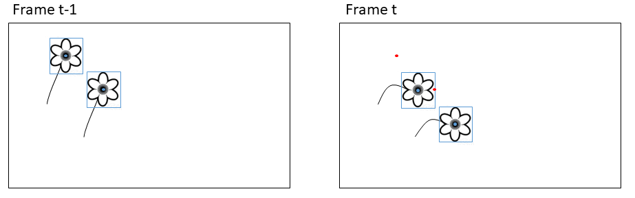

```{r eval = FALSE, echo=FALSE}
library(knitr)
knit('ManuscriptDraft.Rmd')
rmarkdown::render("ManuscriptDraft.Rmd", output_file = "ManuscriptDraft.docx")
system2("open","ManuscriptDraft.docx")
```


\newpage
**NOTES**

What questions do we want to answer?

*Flower information*


\pagebreak


# Introduction

The flowering phenology of a population may mask responses at the individual level. For example, 

Does flower visitation rates and/or reproductive success depend on the timing of flowering for the indiviual flower?


# Material and methods

## Study site


## The image series

## Flower annotations


We built a framework for tracking, filtering, and evaluating tracking of objects in time-lapse image series.

# Automatic tracking

Our algorithm tracks objects based on distances between centroids of bounding boxes. 

The tracking algorithm has a set of user adjusted parameters that can optimise tracking accuracy.

The parameters are particularly relevant for optimal tracking of objects that are constrained to a specific area such as flowers.

It is important to note, however, that the tracking algorithm can be used to track any objects.

The tracking algorithm can be applied both offline (on a set of detections/annotations that have already been produced) or online (real-time tracking frame per frame).

The speed of the tracking algorithm depends on the computational power available as well as the number of objects that are being tracked.


### User parameters

**Max distance threshold**, **running mean**, **max disappeared**, 


As the wind shifts, the flower heads changes direction. This can happen instantaneously (i.e. between two censecutive frames). As they are constrained by their stalk, there is a limit to the distance they can move.

Establishing associations between points based on just the distance between points in the current and the previous frame can cause errors when flowers are in close vicinity of each other.

The flowers move around a center point because of their stalk. We base the tracking on the distance between a point in the current frame and the running mean of the positions of the previous X points in a track.

As winds shift, flowers close to the edge of the image .. may move in and out of view. If a flower reappears in the same area as a flower is already being tracked after disappearing in a few frames, it is a reasonable assumption that it is the same individual and not that the old flower wilted/disappeared and a new one developed. The parameter **max disappeared** sets the number of frames a track can be lost before a new track is initiated for points appearing in the same area.

Similarly, this deals with potential false negatives. If a given flower has not been annotated in a single frame, it should not be assigned a new track.

Setting **max disappeared** to 0 tracks objects based on the coordinates of the points in the previous frame.

The counter for number of disappeared frames is reset when a new point is associated with the track within the threshold.


# Evaluating tracking perfomance

Mota counts tracking mismathces (shifts in a track).


To derive flowering length, in theory we just need to track the most extreme points correctly and don't care about other points (although we filter by length when overlap).

To associate other information to the flower, for example flower visits, we want as much as possible of the track to be correct.

Lastly, we may be interested in the number of flowers that existed in a plot. Therefore, a final way of evaluating automatic flower tracking performance is to compare the number of tracks identified by the automatic tracking with the true number of flowers in a series. These should ideally be equal.

## Filtering tracks

Tracks that overlap have significant risk of errors. Overlapping tracks can be caused by a single flower that was erroneously assigned to several tracks, two flowers that were located sufficiently close to each other that there areas overlapped (e.g. when wind moves the flowers around), false positive detections close to a flower.Best case is two flowers that flowered in the same area but were separated by time. Here we will remove overlapping tracks to reduce the risk of error.

We disregard single points that were not associated to a track. For tracks consisting of two points, we establish the straight line between the points. For tracks consisting of three points, we establish the triangle from the points. For tracks consisting of more than three points, we calculate the convex hull of all the points included in the track and derive the polygon from the vertices of the convex hull.

We then check if any two lines intersect (for tracks with two points), if any lines intersect with any polygons, and if any polygons overlap with other polygons, and remove tracks that overlap.

We evaluate the accuracy of the remaining tracks.


# Results


{ width=100% }

**Figure 1:** Simple centroid tracking may produce erronous associations when objects move between frames. Blue shows detections in the current frame (bounding box and centroid point). Red shows centroid points for the detections in the previous frame.

# Results

**Figure 1:** Figure text....


# Discussion

## Flower phenology


# Acknowledgements


# Data availability

The code that supports the results in this paper will be made openly available at https://github.com/TECOLOGYxyz. Raw data as well as the trained flower detection model will be archived on https://zenodo.org/.


