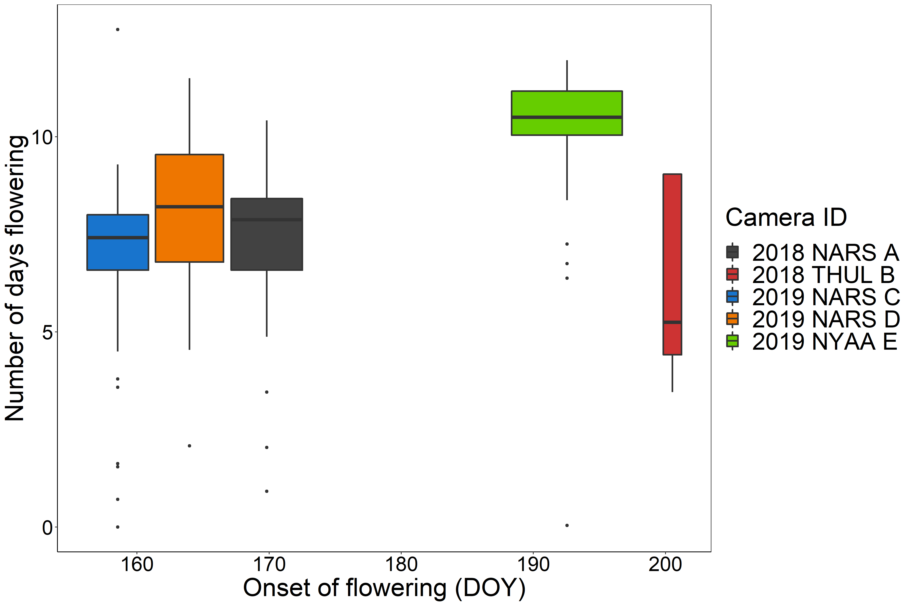
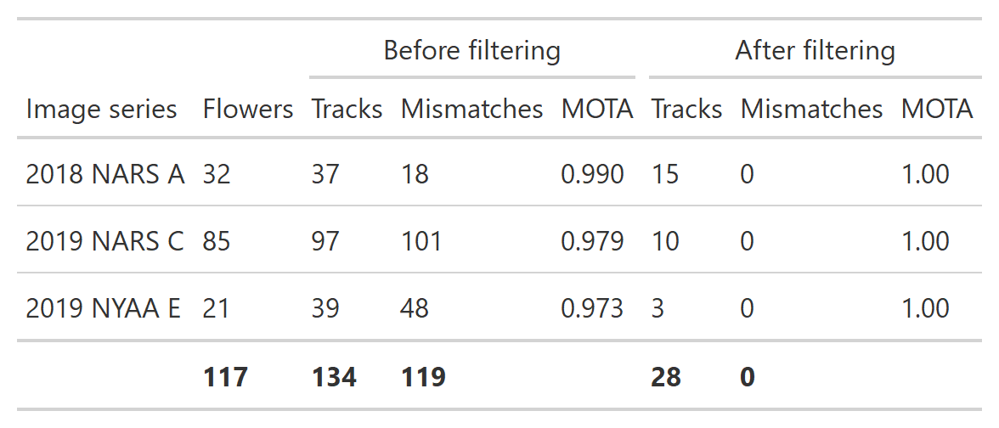

```{r eval = FALSE, echo=FALSE}
library(knitr)
knit('ManuscriptDraft.Rmd')
rmarkdown::render("ManuscriptDraft.Rmd", output_file = "ManuscriptDraft.docx")
system2("open","ManuscriptDraft.docx")
```

```{r echo=FALSE}
# Function for creating word comments in Rmarkdown
# Use: This text contains a `r word_comment("This is the comment", "comment.")`.

word_comment <- function(comment, highlight = "") {
  if (isTRUE(knitr:::pandoc_to() == "docx")) {
    paste0('[', comment, ']{.comment-start id="0" author="Hjalte M."',
           'date="2020-01"}', highlight, '[]{.comment-end id="0"}')
  }
}
```

```{r echo=FALSE}
# Camera codes:
# 2018 NARS-04: 2018 NARS A
# 2018 THUL-01: 2018 THUL B
# 2019 NARS-13: 2019 NARS C
# 2019 NARS-17: 2019 NARS D
# 2019 NYAA-04: 2019 NYAA E

```

Title:

**Towards individual-based pollination ecology: Automatic tracking of life histories of individual flowers**

# 

Authors:

Hjalte M. R. Mann^1,2^, Alexandros Iosifidis^2^, Toke T. Høye^1^

# 

Author affiliations:

1: Department of Ecoscience and Arctic Research Centre, Aarhus University, C.F. Møllers Allé 8, 8000 Aarhus C, Denmark\
2: Department of Electrical and Computer Engineering -- Signal Processing and Machine Learning, Aarhus University, Finlandsgade 22, 8200 Aarhus N, Denmark

# 

Corresponding author contact information:

Hjalte Mads Rosenstand Mann\
E-mail: [mann\@ecos.au.dk](mailto:mann@ecos.au.dk){.email}\
Phone: +45 31178585

# 

ORCID IDs:

HMRM: 0000-0002-4768-4767, AI: 0000-0003-4807-1345, TTH: 0000-0001-5387-3284

# 

Keywords: Arctic, *Dryas octopetala*, *Dryas integrifolia*, ecological monitoring, flowering phenology, life-history variation, tracking

\newpage

# Abstract

A fundamental challenge in pollination ecology is to understand how successful pollination is affected by the timing of flowering, the timing and frequency of pollinator visits, and the abundance and diversity of visitors. Since plant-pollinator interactions concern individual flowers, deciphering the consequences of e.g. shifts in the frequency of flower visits for plant reproductive success should ideally be based on observations of individual flowers throughout their entire flowering period. Due to the overwhelming logistical challenge of collecting such data by direct observation, it has rarely been done. Here, we show that image-based monitoring of field plots at very high temporal resolution can return information on flowering phenology at the level of individual flowers. Further, we present a framework for automatically tracking flowers in time-lapse image series, evaluating tracking accuracy, and identifying unreliable tracks. Our results on individual flower phenology suggest that traditional weekly observations of flower plots are insufficient to capture details in flowering dynamics. We show that the results of our automated method are reliable by comparing with manual tracking of individual flower phenology. Our method could facilitate fine-grained studies on flower phenology and could be an important tool for estimating the sensitivity of plant-pollinator interactions to climate change.

\newpage

# Introduction

The Arctic is characterized by short growing seasons and for the individual plant, timing of flowering is of critical importance. Flowering too early increases the risk of frost damage to the flowers, while flowering too late limits the time for seed maturation and dispersal before the end of the growing season [@pardee2019; @ELZINGA2007; @inouye2008; @iler2021]. Further, for insect-pollinated plants, flowering must be synchronous with pollinator activity for successful reproduction. Both flower and insect phenology is partly driven by abiotic cues such as snowmelt and temperature and can thus be sensitive to climate change. Changes in flower phenology as a consequence of climate change may indirectly affect the abundance of flower-dependent insect species [@hoye2013] and these effects can be stronger than the direct effects of climate change [@ogilvie2017]. However, the relation between flower phenology and reproductive success is not well understood. For example, @bolmgren2015 found that for an insect-pollinated plant species, early flowering was associated with increased fruit-set but late flowering was associated with higher seed mass. If we are to understand the intricate dynamics of plant-pollinator interactions, tools that aid efficient and comprehensive data collection are essential.

Monitoring flower phenology at high temporal resolution is time-consuming, particularly in logistically challenging environments such as the Arctic. Consequently, flowering phenology of a population is often characterized simply by the date for onset of flowering, typically derived from weekly observations in permanent plots [@Prevey2021]. Such crude estimates may fail to reveal important dynamics in flowering phenology through the season. For example, different phenological factors, such as onset, peak, and end of flowering may respond differently to climate change [@cook2012] and estimation of the degree of mismatch between species may thus be sensitive to the choice of metric [@inouye2019]. The optimal metric for phenology depends on the research question, but often the choice of recording first flowering dates to represent flowering phenology is pragmatic rather than ideal. In fact, first flowering dates may be particularly ill suited for estimating sensitivity to climate change [@miller2008] since they represent the very extreme of the phenological distribution of a population and may be confounded with e.g. the size of the population considered. An accurate estimate of the phenological distribution of a population over the full season would allow for, for example, accurate quantification of resource availability through the season and temporal mismatches between species [@ramakers2020]. However, even detailed information on phenology of a population is still an aggregation of the phenology of the individual members of the population for which important variation may be masked [@inouye2019]. With the full distribution of flowering phenology at the level of individuals, it is possible to extract relevant characteristics of the distribution and test their individual sensitivities towards environmental factors, but acquiring such data requires efficient and preferably automated methods.

Cameras have become an ubiquitous tool for non-invasive and efficient monitoring of natural processes [@howe2017; @glover2019], but the implementation of image-based data collection has outpaced the development of methods for processing and analysing the big data output [@weinstein2018; @farley2018]. Gradually, computer vision and deep learning tools are being developed and applied for automatic processing and extraction of relevant data from images [@willi2019; @tabak2019; @hoye2021]. Indeed, automatic image-based monitoring of flowering phenology coupled with deep learning has facilitated collection of phenology data for specific species at very high temporal resolution [@mann2022]. Yet, phenological responses at the individual level may be indiscernible regardless of the temporal resolution of the data at population level. For example, a shortening of individual flower longevity may not be directly obvious at the population level. In fact, many research questions can only be directly explored on the basis of phenology data at the level of individuals. For example, investigating the association between reproductive success and timing of flowering and/or flower longevity requires such data. Individual level data would also aid the understanding of whether flower visitation rates and/or seed set depends on the timing of flowering for the individual flower. Thus, automated tracking of flowers in image-series of permanent plots to derive individual flower phenology would be ideal.

Most multiple object tracking literature focus on tracking of humans [@luo2021; @milan2016], and these methods not necessarily directly transferable to other use-cases. Many tracking algorithms, such as the Simple online and real-time tracking (SORT) [@sort], rely on Kalmann filtering to predict the future location of an object by estimating its velocity from previous frames [@kalmann]. However, Kalman filtering assumes linear motion of the object and does not handle abrupt motion well. Flowers are constrained in movement by their stalk and violates this assumption. Other tracking approaches, such as DeepSORT [@deepsort2017], use tracking-by-detection in which convolutional neural networks (CNNs) are applied to continuously distinguish individuals through time, thus aiding the tracking algorithm. Flowers, however, are unlikely to be clearly distinguishable and one flower may look less alike between two frames than two flowers in a single frame, which prevents this approach. Finally, some tracking methods require manual initiation of tracks for a fixed number of objects in the first frame and the algorithm then tracks these objects in the subsequent frames [@hu2012]. These methods do not allow objects to enter or disappear from frame during tracking. In full-season monitoring data, flowers will disappear from the frame when they wilt, in which case their track should be terminated. Oppositely, new flowers should continuously be tracked as they bloom throughout the season. Additionally, a flower tracking method must handle flowers disappearing and appearing at the edges of the frame. Clearly, individual flower tracking is a challenging task.

Here, we present and evaluate a simple multiple object tracking algorithm for automatic tracking of individual flowers in image-series. Our flower tracking algorithm assigns individual flowers to tracks based on the minimum distance between centroids of bounding boxes and does not rely on prediction of future positions. Further, the method allows both initiation and termination of tracks during tracking. We describe three user-defined parameters to help optimise tracking of flowers in particular. We use time-lapse image-series from full-season monitoring of two widespread Arctic flowering plant species *Dryas integrifolia* and *D. octopetala*. For complex scenes with many flowers in close vicinity to each other there is a substantial risk of tracking errors regardless of the tracking method being used. In such cases, it may still be possible to reliably track a subset of the flowers, which are spatially isolated in the frames. For this, we suggest a conservative filtering approach based on the distance between tracks within the frame. Overall, we show that information on phenology at the level of individual flowers can be automatically derived from image-based monitoring of flower plots.

# Material and methods

## Study site and species

This study is based on five full-season time-lapse image series collected at the following three Arctic sites (site abbreviation and sampling years in parentheses): Narsarsuaq (NARS), South Greenland (2018, 2019), Thule (THUL), North-West Greenland (2018), Ny-Ålesund (NYAA), Svalbard (2019). The images were captured using time-lapse cameras (Moultrie Wingscapes TimelapseCam Pro, Moultrie Products, Birmingham Alabama, USA) permanently positioned approx. 60 cm above areas with either *Dryas integrifolia* in Narsarsuaq and Thule or *D. octopetala* in Ny-Ålesund. The white flowers of these two species are insect-pollinated and held erect above cushions of foliage. The species are native to and widespread in Asian, North American, and European Arctic and alpine regions. They are geographically separated except for a possible hybrid zone in North-East Greenland [@philipp2003].

## The image series and flower annotations

Images were collected throughout the full growing seasons. While the original time-lapse frequency was higher, the basis for this study was 1-hour interval series. We limited these series to include only the flowering season and, to limit the workload for manual annotation, randomly sampled images from each series. The number of images for each series after sampling is given in Table 1. All flowers in bloom within each of these image were manually annotated using the rectangular bounding box tool in the VIA VGG annotation software [@dutta2019] and each individual flower was assigned a unique ID that was maintained throughout its lifetime. These annotations constitute our ground truth tracks. The series varied substantially in the number of flowers they contained (Table 1). Examples of annotated images from the 2019 NARS C series at three different times in the flowering season are given in Figure 1. To demonstrate how individual flower tracking can result in detailed representations of flower phenology across the season, we use the ground truth annotations to show the variation in duration of flowering for each series.

**Table 1:** Number of images and number of individual flowers for each of the five time-lapse image series.

# 

{width="40%"}

# 

{width="20%"}

**Figure 1:** Examples of annotated images for 2019 NARS C. A: Onset of flowering at DOY 145. B: Peak flowering at day of year (DOY) 151 (52 annotated flowers). C: 6 days after peak flowering (DOY 157). Flower bounding boxes are colour-coded by flower ID. D: Centroids of all flower annotations in the series, coloured by flower ID, showing how flowers may overlap in space.

## Automatic flower tracking

We built a framework for tracking, filtering, and evaluating tracking of objects in time-lapse image series. The tracking algorithm (suppl. 1) tracks objects based on distances between centroids of bounding boxes, that is, objects with minimum displacement between frames are associated. The algorithm has a set of user-adjusted parameters that can optimize tracking accuracy. The parameters are particularly relevant for tracking of objects that are constrained to a specific area such as flowers. However, the tracking algorithm could be used to track any objects. The speed of the tracking algorithm depends on the computational power available as well as the number of objects that are being tracked, but the time for computation will be negligible in most use-cases. Tracking of a series containing 85 objects ran at \~0.02 seconds per frame on a standard laptop. This, together with the fact that the algorithm handles frames sequentially, means that it can be applied both offline (on a set of detections/annotations that have already been produced) or online (real-time tracking frame per frame).

Several issues complicate the task of tracking individual flowers through time-lapse image series. First, as flowers move, they may temporarily occlude the view of other flowers and flowers close to the edge of the frame may move in and out of view between images. This can cause a track to be lost and a new track to be erroneously initiated when the flower reappears (Fig. 2A), a tracking error known as fragmentation. However, if a flower reappears in the same area as a flower is already being tracked after disappearing in only a few frames, it is a reasonable assumption that it is the same individual and not that the old flower wilted/disappeared and a new one developed. The parameter **max gap** sets the number of frames a flower can be absent before reappearing without the track ending and a new initiating. If a given flower has not been detected in a number of frames exceeding the max gap size, the track will be terminated. Concurrently, this can deal with potential false negatives, as a track that is missing a bounding box will not be lost.

Second, a standard centroid tracking algorithm will associate a point with a track based on minimum distance only, disregarding the absolute distance between centroids, which may lead to tracking errors (Fig. 2B). However, as flowers are constrained in their displacement, we can assume a maximum distance between points and force the initiation of tracks for points that exceed this threshold. We set this threshold with the parameter **max distance,** measured as the euclidean distance in number of pixels between objects in neighbouring frames.

Third, reliable tracking based on distance requires that movement of individuals are captured at sufficient frequency, such that each tracks are not switched between frames. Stand-alone image-based monitoring of the relatively slow process of flower development through full growing seasons (several months) is done with low frame rate, limited by power consumption and storage capacity both on and off the camera. Here, we used several images per day and while this temporal resolution captures the phenology of the flowers at very high detail, they fail to capture the full movement of flowers. For example, as the wind shifts, the flower heads change direction, which in the image series happens instantaneously (i.e., between two consecutive frames) (Fig. 2C). The fact that the frame rate is insufficient to capture smooth movement means that bounding boxes around a single individual in two consecutive frames cannot be associated based on overlap (e.g. intersection over union) as there often is no overlap. With a high number of flowers in close vicinity to each other, there's a substantial risk of identity switching between flowers as they move among each other (Fig. 1B). Additionally, as the flowers are constrained by their stalk, there is a limit to the distance they can move, which prevents prediction of future location of an individual based on its previous trajectory. Here, we introduce the tracking parameter **running mean**, with which we can base tracking on the distance between a point in the current frame and the running mean of the positions of a number of previous points in a track, taking advantage of the fact that a flower moves around a central point. Increasing the value for this parameter decreases the weighting of movement between individual frames. Setting the parameter to 1 means that tracking is based on the distance to the centroid in the previous frame only.

# 

![Figure 2: Centroid tracking may produce erroneous associations when objects move or disappear between frames. A: A flower temporarily disappears from view. If gaps in tracks are not allowed during tracking, a new track will erroneously be initiated when the flower reappears. B: A flower disappears from view and another reappears between two frames. If no threshold for maximum distance between an object and a track is set, the reappearing flower will be linked to the track of the disappearing flower based on shortest distance despite the absolute distance being large. C: A flower is linked to the track of another flower. As flowers move around a central point, it is relevant to base tracking on a running mean of previous positions. Dots show position of flower in previous frame. Crosses show running mean of positions in x \> 1 number of previous frames. Dots and crosses coloured according to track identity.](../figures/ErrorFigure2.png){width="100%"}

### Input data for the tracking algorithm

The input data for the tracking algorithm are bounding box coordinates for each object in each frame given in a commonly used format [@everingham2010]: frame number, x-min, y-min, x-max, y-max. Here, x-min, y-min is the top left corner of the bounding box and x-max, y-max is the bottom right corner. The bounding box centroid is calculated on the basis of these coordinates within the algorithm. Calculating tracking accuracy requires a ground truth ID for each bounding box which can be given as the sixth column. As this data returned from both manual object annotations and object detection methods using automatic object detection methods based on deep learning, the method can be applied on both manually and automatically derived data.

# 

### Identifying optimal user parameters

To explore the effect of the three tracking parameters and to identify the optimal combination of parameters for our use-case of tracking flowers, we applied the tracking algorithm on each of the five image series with every combination of a range of values for each parameter (3179 combinations): 0-160 with a step size of 10 for max gap; 1-160 with a step size of 10 for running mean; 0-1000 with a step size of 100 for max distance. Note that max distance set to zero ignores the parameter altogether. We identified the setting(s) that returned the most accurate tracks for each series and compare the tracking results between optimal settings and all parameters ignored (imax gap = 0, running mean = 1, max distance = 0).

## Evaluating tracking performance

The optimal way of quantifying tracking performance depends on the goal of the tracking. For example, in our case of tracking flowers, associating information obtained in the images to the individual flower, for example flower visits, would require the track to be as correct as possible (i.e., identity shifts should be minimized). On the other hand, to derive flowering length in practice just requires correct association between the first and the last image of a flower while intermediate points can be ignored. Here, track fragmentation can lead to underestimation of flowering duration (and overestimation of number of flowers) while track merging can lead to overestimation of flowering duration (and underestimation of number of flowers). In some scenarios one may be interested in the number of individual flowers that existed in a plot, in which case the number of tracks obtained by automatic tracking should closely resemble the actual number of individuals in the series.

Here, we apply the commonly used multiple object tracking accuracy (MOTA) score which quantifies tracking performance based on tracking mismatches derived by counting the number of identity shifts within each track [@bernardin2008]. Mismatches occur when objects swap track identity because they are in close vicinity of each other or when an object periodically disappears and is assigned a new track identity when it reappears. Only the shifts in tracking identity are counted as mismatches in the MOTA score, while the number of points assigned to each track is not considered. For example, a ground truth track that was assigned one ID for the first half of its lifetime and another for the remaining half would only constitute one error.

$$
MOTA = 1 -  \frac{\sum{_t(fn_t + fp_t + mm_t)}}{\sum{_tg_t}},
$$

where fn, fp, and mm are the number of false negatives, false positives, and track mismatches, respectively, for frame t divided by the total number of ground truth annotations across all frames. The MOTA score ranges from -Inf to 1 with 1 being perfect detection and tracking. As tracking accuracy is commonly evaluated between manual annotations and detections, produced, for example, by a convolutional neural network (CNN), the MOTA score included false positive and false negatives as errors, but in our case, since we are tracking on ground truth data and our annotations and detections therefore are practically identical, these variables can be ignored.

To evaluate tracking accuracy of our algorithm, we calculate the total number of mismatches as well as the MOTA score (number of mismatches in relation to the total number of points). Additionally, we derive the number of tracks that were tracked with more than 80% accuracy. Finally, we compare the number of tracks identified by the automatic tracking with the true number of flowers in a series. These should ideally be equal. However, we note that a correct number of tracks (i.e., number of tracks equal to number of objects) does not necessarily translate to correct tracking, since individual tracks can be erroneously split (fragmentation) by the tracking algorithm while several tracks can be merged into one. We present the tracking performance without the use of the three tracking parameters along with the best performance (lowest number of mismatches/highest MOTA), and the best performance where the number of tracks correspond to the number of individual flowers in the series.

## Identifying the most reliably tracked flowers

In order to be able to identify the most reliably tracked flowers without the need for manual annotation, we use a conservative filtering method that extracts the most trustworthy tracks from a scene based on spatial distance between tracks. We derive the distance between tracks based on the centroids of points included in a track produced by the tracking algorithm. When tracks consist of only a single point, the coordinates of the point is used as the centroid. For tracks consisting of two points. we use the midpoint of the line between them. For tracks consisting of three points or more, we calculate the convex hull of all the points included in the track and use the centroid of this polygon. For the special case where a track contains more than two points but where the points are collinear, we use the midpoint of the line through the points. We hereafter refer to these centroids as track centroids.

The filtering is done on the centroids to remove tracks in close vicinity to each other as these are assumed to have a high risk of tracking mismatches. The distances between all track centroids are calculated (euclidean distance in number of pixels) and only tracks that have no neighbouring centroid within the filtering distance threshold are kept.

We demonstrate the filtering method on the three series for which our tracking algorithm did not return perfect results (i.e., automatic tracking identical to ground truth tracks). To test the filtering approach, we chose a fixed combination of the tracking algorithm parameters across all three series (max gap size: 10; running mean: 10; max distance: 300). We then applied the filtering method on each three series with a range of values for the filtering distance (50-500, step size of 50) and identified the value that returned the highest sum of tracks across the three series at the lowest number of mismatches. We present the tracking accuracy before filtering and on the remaining tracks after filtering. We emphasize that our results are conservative and that the approach may be optimised to extract a higher number of tracks while maintaining the number of mismatches. For example, basing the filtering on the best performing tracking parameters for each series specifically would improve the output of the tracking algorithm. Similarly, the results could be improved by fine-tuning the filtering distance threshold for each series individually. However, as our goal here was to demonstrate that our tracking and filtering method can be applied in a naive setting with fixed values for each parameter, we have not included those results.

## 

# Results

Manual tracking of individual flowers derived from image-based plot monitoring enabled detailed information on flower phenology at the level of individuals with substantial variation in flowering duration between flowers (Fig. 3). Further, our tracking algorithm was able to track individual flowers with consistently high accuracy (MOTA $\geq$ 0.981) across all series. In all cases, all flowers were tracked with more than 80% accuracy (Table 2). In fact, two series were tracked without any errors (2018 THUL B and 2018 NARS D). Tracking with the three tracking parameters ignored (max gap = 0, max distance = 0, running mean = 1) returned high MOTA scores across series, but for the three series that were not tracked perfectly, utilizing the tracking parameters increased the MOTA score in all cases.

Importantly, the tracking that returned the lowest number of mismatches did not necessarily result in a number of tracks equal to the number of flowers in a plot. For example, for the series with the most flowers, 2019 NARS C, one combination of parameters (max gap = 20, max distance = 600, running mean = 1), returned the lowest number of mismatches (31), but the number of tracks were lower than the actual number of flowers (71 vs. 85). One combination of parameters did return a number of tracks equal to number of flowers (max gap = 10, max distance 400, running mean = 10), but also increased the number of mismatches to 91. For 2019 NARS D, several combinations of parameters returned a perfect MOTA score, but still some combinations returned a number of tracks lower than the number of flowers. This demonstrates the significance of a special case of tracking error, namely merging of tracks, which is not accounted for in the MOTA score. In Figure 4, we exemplify the two types of errors, identity shifts and merges.

# 

{alt="Figure 2: Flowering lifespan (days) for each individual flower in each of the five image series plotted against the onset of flowering in days after 1 January (day of the year) based on manual tracking of individual flowers."}\

Figure 3: Variation in flowering lifespan (days) for the flowers of each of the five image series plotted against the onset of flowering in days after 1 January (day of the year, DOY) based on manual tracking of individual flowers.

![Table 2: Tracking performance for the automatic flower tracking algorithm for different tracking parameter combinations. Number of tracks in bold shows when the number of tracks equals the number of flowers in the series. Tracking performance is shown for parameters zeroed (PZ) (Max gap = 0; Max distance = 0; Running mean = 1), minimum number of mismatches achieved (MM), and minimum number of mismatches achieved with a number of tracks equal to the number of flowers in the seris (CF MM). The last type is only given if it was not equal to the results for MM. When several parameter combinations returned the same results, the range of parameter values included is given for each parameter.](../figures/tab_1.png){width="100%"}

{width="100%"}

**Figure 4:** Tracking results of three flowers in the 2018 NARS A image series. A: Track output from the flower tracking algorithm for three individual flowers using two different combinations of tracking parameters. The y-axis shows the correct track IDs assigned by manual tracking. Each track is coloured by the IDs assigned by the flower tracking algorithm. In the top panel (max gap = 10, running mean = 1, max distance = 0), flower 15 and 28 have no identity shifts within each track, but the two tracks have been merged into one (see B). Flower 25 has been fragmented into two separate tracks causing one mismatch (see C). In the bottom panel, the running mean parameter has been increased to 20 and max distance to 500, which results in correct tracking of all three flowers. B: Merging error between two tracks. Frame f shows the last frame with flower 15 (blue) annotated because it has wilted. Two frames (5 hours) later (f+2), a new flower (flower 28; blue) blooms. Since max gap \> 2 and no distance threshold has been set, flower 28 is associated with the tracks of flower 15, because all other flowers are closer to their respective tracks, which causes a merging error. Setting a max distance threshold to 500 fixed this error as illustrated in A. C: Identity shift error between two flowers. A gust of wind causes a displacement of the flowers between two frames, f and f+1, (7 hours apart), which causes an identity shift between flower 25 and flower 29. Setting running mean to 20 fixed this error as illustrated in A.

With our filtering method, we were able to identify tracks with no mismatch errors in all three series that were not perfectly tracked. The parameter value for filtering distance that returned the highest number of tracks at the lowest number of mismatches was 350 (results for all values given in suppl. 2). The results of the filtering algorithm on the three series are given in Table 3 and the filtering process is visualised in Figure 5. Our filtering method extracted 28 tracks from the three series (2018 NARS A: 15 tracks; 2019 NARS C: 10 tracks; 2019 NYAA E: 3 tracks) with complex scenes using a fixed filtering distance value of 350 and fixed values for the tracking parameters (10, 300, 10 for max gap size, max distance, and running mean, respectively) without any mismatches included in the 28 tracks.

**Table 3:** Results of the filtering algorithm on tracking results using the parameters 10, 300, 10 for max gap size, max distance, and running mean, respectively. The filtering distance value of 350 was used for all three series.

{width="100%"}

# 

![Figure 5: The track filtering process exemplified by the 2019 NARS C series. A: The centroid points for all bounding boxes in the series, coloured by the track id from the centroid tracking algorithm. B: The track convex hull polygons calculated from the tracks. Polygons with a euclidean distance below 350 between them have been grouped together. The polygons have been coloured according to group. C: The results of the filtering where all tracks that were not sufficiently spatially isolated were removed, resulting in 10 remaining tracks without tracking errors.](images/filterFigLet.png)

# Discussion

## Tracking

In this paper, we have demonstrated the potential of image-based monitoring for collecting information on flower phenology at the level of individuals. The automatic tracking and filtering pipeline presented was able to return reliable flower tracks despite settings that violate assumptions of standard tracking algorithms and complex scenes with a high number of objects that are not permanent within the series. Our tracking algorithm was capable of accurately tracking individual flowers, despite the difficult setting. Even with simple centroid tracking where association is based solely on displacement between the current and previous frame, tracking performance was high for all series and perfect for two. Further, with our filtering approach based on distance between tracks, we were able to discard the least reliable tracks and thereby increase the mean tracking accuracy of the remaining flowers to a perfect score.

Our results show substantial variation in flowering duration between individual flowers. In fact, flower longevity was less than a few days in some cases. As flowers may not be visible within the frame for their full lifespan, it is likely that for some flowers the full flowering has not been captured, although flowering durations of less than 24 hours has been observed from manual examination of the image series (Mann, personal observation).

The two series for which the tracking algorithm produced perfect results were also the series with the lowest number of flowers. While an increased number of objects does not necessarily increase tracking difficulty as this depends on the degree of isolation of tracks in time and space [@beard2018], multiple object tracking is a challenging task. Here, since the flowers are limited in space and time, the complexity of tracking likely increases with increasing number of flowers. A higher number of flowers within the frame increases the possibility of flowers appearing in close proximity to each other and that flowers overlap or move in and out of frame. All these situations translate to a higher risk of tracking errors. The very high complexity in the scenes with many flowers, especially 2019 NARS C with 85 flowers, coupled with the low frame rate renders it unlikely that any tracking method could produce perfect results across series. Although 2019 NARS C can be considered an extreme case for our application, it underlines the relevance of a pipeline including both tracking and filtering. But further, it points to the possibility of filtering image series based on an estimate of the number of flowers before tracking. For example, with many image series available, series with less than a given maximum of flowers detected in a single frame over a season could be selected for subsequent tracking. Tracks in series that exceeded this threshold could be filtered after tracking, as demonstrated here, or selected for manual validation of results.

Our results show that optimizing for high MOTA tends to lead to an underestimate of the number of tracks (i.e., merging of tracks occurs) (Table 2). This may happen, for example, because of the max gap parameter. Importantly, this parameter allows for temporary occlusion of a flower within a track (which would decrease the number of mismatches) but may also cause merging of two flower tracks if they bloom in the same area separated by a number of frames less than the threshold value set. Thus, even if the number of tracks equals the number of flowers, it does not necessarily follow that the tracking is correct. For instance, the tracking algorithm could split one ground truth track in two, but combine two other ground truth tracks into one, as seen in Figure 3. The task of evaluating multiple object tracking accuracy is a major challenge in itself [@luiten2020; @milan2013; @milan2016] and in a future study, other tracking accuracy metrics could be implemented, that account for merging errors in a better way. Tracking flowers may be a challenge that is especially prone to these errors since flowers can bloom in the same area at different times during the season.

The optimal settings for the three tracking parameters fell into a narrow range for the three complex series, except for the running mean for 2019 NYAA E. The optimal values for the running mean for 2019 NYAA E were exceptionally high, compared to the other series. Interestingly, the average flower duration was also higher for this series and this could be part of the explanation, as longer lifespan allow for larger gaps in the tracks. Overall, the max gap parameter improved tracking accuracy with values of 10-20 being optimal. The three series with complex scenes all contain flowers at the edge of the frame (see Fig. 1), which means that they may occasionally be outside of view of the camera. Further, the higher number of flowers increase the risk of flowers temporarily occluding others. Correct tracking of these objects requires that an object can disappear from view without the track instantly being lost, which the max gap size allows. Oppositely, this setting may also lead to merging error. The optimal range for max distance was relatively narrow (400-600) for the parameters producing the correct number of tracks with the lowest number of mismatches. The optimal value for this setting is one that is sufficiently high that it does not force individual flowers into separate tracks because of movement between frames yet is low enough to separate any flowers into individual tracks that would otherwise have been grouped together. This explains why the extreme values for this parameter was not included in the highest accuracy tracks.

It is important to note that the tracking parameters are not independent. For example, the distance between a point in the current frame and a point in the previous frame may not be the same as that for a point in the current frame and the mean location of the previous ten points in a track. Thus, changing the setting for running mean could influence the optimal parameter setting for max distance. This underlines the relevance of searching for an optimal parameter combination based on ground truth data. As with any tracking method, accuracy can only be assessed based on visual observation or, more rigorously, by testing on ground truth data [@dendorfer2021; @luiten2020; @milan2016]. However, the fact that the optimal tracking parameters were overall similar across series strengthens the assumptions that a set of standard values can produce reasonable results for other similar image series with *Dryas* flowers. Here, a combination such as 10, 500, 10, for max gap, max distance, and running, respectively, would be a good starting point. When applying our method in a new setting, we recommend performing a parameter test as demonstrated here on a subset of ground truth tracks to derive the optimal set of parameters.

We demonstrated our method on manual annotations of flowers but note that the format of the input data matches the output of deep learning object detection methods [@everingham2010]. Thus, the method can be directly applied on such data. Automatically detecting flowers would likely introduce a proportion of false negatives when the detection algorithm fails to detect an object. The flowers in our data that periodically move out of the frame or are temporarily occluded mimics false negatives. Thus, it is likely that the max gap parameter can alleviate problems with false negatives. Automatic detection methods may also introduce false positives. These detections would be included in the tracking along with correct detections. Some cases of false positives, for example isolated single false positives, could be removed automatically while other cases may require manual quality control. In general, the performance of a tracking algorithm depends on the quality of input data and it is advisable to optimise detection accuracy before moving to tracking. The fact that our method produced perfect tracking results in the most simple settings (fewest flowers) could be taken into consideration when setting up future data collection schemes.

## Filtering

We presented a filtering method based on the distance between track centroids, which can be applied subsequent of tracking. The filtering algorithm successfully extracted 28 correct tracks from each of the three series for which the tracking algorithm did not produce perfect results without a single mismatch. Extracting tracks that are spatially isolated does not guarantee that the tracks are correct/without errors. For example, tracks of several objects may have been erroneously merged or a track could contain a small proportion of instances of an object far away, which would not have a large effect on the track centroid position. However, as spatially isolated objects in general are easier to track, it is safe to assume that these tracks are more reliable. We applied the filtering algorithm on tracks produced with a fixed set of tracking parameters as well as a fixed value for the filtering distance. As in the case of the tracking parameters, we recommend setting the value for the filtering distance based on either visual examination of results or on tests on a subset of ground truth data when applying the method in a new setting, but for tracking *Dryas* flowers in similar image series, a value of 350 may be a good starting point. We note that our method for filtering tracks using track centroids ensures that all tracks, despite the number of points in the track, are given the same weighting in the filtering since each track is represented by a single point. In some cases, this may be suboptimal. For example, if it is given a priori that an object will always appear in a minimum of two frames, then single point tracks can be filtered out. However, when such a priori knowledge is not available, a conservative approach, as the one we present, is preferable.

An alternative approach to filtering based on distance between track centroids could be to identify and discard track polygons that overlap. However, this would remove tracks with even minor overlap and put weight on tracks with many points as these typically cover a larger area. Another alternative could be to base filtering on the centroids of the points within a track (i.e., mean x and mean y). The presented method avoids weighting track geometries based on number of included points and avoids weighting the centroid coordinate based on the point coordinates within the track as the track centroid is based on the convex hull of the track points. Additionally, it allows for overlap between track geometries as long as the distance between the track centroids is above the threshold. We note, however, that other approaches may be more suitable in other settings and applications.

# Significance for ecological studies

Our results show that it is feasible to collect and analyse individual flower phenology at large scale at logistically challenging sites, which is a significant contribution towards automatic and efficient phenology data collection. The possibility of collecting individual level flower phenology is highly relevant for exploration of many research questions. For example, it would be possible to assign indicators of seed set to the individual and explore how seed set is affected by timing and length of flowering and/or abiotic conditions such as frost events. Hereby, the long-standing question of what drives variation in reproductive success of individual flowers could be explored [@bolmgren2015]. Further, the fact that it was not uncommon in our results that flowering lasted less than a week, emphasizes that weekly observations of sample plots can be insufficient for comprehensive description of flower phenology [@Prevey2021].

By simultaneously tracking flower visits, these could be assigned to the individual flower and visitation rates per flower could be derived and the effects on reproductive success could be investigated [@tiusanen2016; @rafferty2012]. Pollen limitation is a common factor limiting the reproductive success of flowering plants. However, the ecological mechanisms behind pollen limitation is poorly understood, at least partly because it requires information on plant seed set in relation to pollinator visitation rates which is difficult to acquire in a natural setting and to a satisfactory extent. For example, pollinator visits can vary greatly in frequency during the flowering season and the degree of pollen limitation can vary even between populations in close vicinity to each other [@larson1999; @ashman2004]. High frequency observations of flower visits coupled with information on phenology and reproductive success at the level of individuals could unravel the relationship between pollinator visitation and plant reproductive success and the climate sensitivity of plant-pollinator interactions. Further, any information on taxonomic or functional grouping could facilitate comparative studies on pollination effectiveness between such groups [@king2013; @foldesi2021]. Importantly, the variables suggested here could be derived directly from the time-lapse images. For example, seed set as an indicator of flower reproductive success could be estimated for individual flowers and flower visitation rates could be quantified by detecting insects in flowers in high temporal resolution image series.

It is clear that the images derived from monitoring of permanent plots can hold substantial amounts of ecologically relevant data. To derive some variables, for example flower visitation rates, image series collected at high temporal frequency is required. As the scale of data increases as well as the number of variables to be extracted from the images increase, automated image analysis becomes relevant. Here, methods from deep learning and computer vision are exceedingly relevant. For instance, it has been demonstrated that convolutional neural networks can facilitate monitoring of pollination events by detecting, identifying, and counting insects [@bjerge2021] and perform fine-grained species classification [@spiesman2021]. Collectively, these developments coupled with implementation of long-term high-frequency image-based monitoring will allow for collection and processing of ecological data at unprecedented scales [@hoye2021]. For flower tracking in particular, our results emphasize that this is not a trivial task. The data violate common assumptions of tracking methods and tracking individual flowers through time-lapse images therefore represents a special case [@chen2022; @betke2007; @luo2021]. For example, since flower movement is constrained by the stalk, the future location of a flower-head cannot be predicted based on previous trajectory of movement. As individual flowers closely resemble each other, tracking cannot be based on recognition of individuals [@chen2022; @deepsort2017]. Further, as the manual tracking of flowers showed, the lifespans of flowers vary substantially, which means that assumptions on flowering duration cannot be leveraged during tracking. These settings vastly complicate the task of tracking multiple objects [@betke2007]. Our tracking algorithm returned consistently accuracy despite this.

While we show that tracking can be done at high accuracy with our tracking algorithm, we also identify particular challenges with flower tracking, such as the violations of standard assumptions in tracking algorithms, the potentially large number of individuals overlapping in time and space, and the possible susceptibility to track merging. To improve tracking ability of flowers in future studies, focus should be on implementing reliable measures of different types of errors and on developing methods that can alleviate the challenges, as well as on comparison of different tracking approaches. Alongside this, methods for extracting auxiliary information from images, such as flower seed set, should be explored.

# Acknowledgements

We thank Cecilie Mielec, Michael Straarup Nielsen and Maarten J. J. E. Loonen for set-up and maintenance of cameras in Ny-Ålesund, Peter Akers and Jeffrey M. Welker for set-up and maintenance of cameras in Thule, and Rebekka Ween and Line Klausen for assistance during fieldwork in Narsarsuaq. TTH acknowledges funding from Independent Research Fund Denmark Grant 8021-00423B. The authors have no conflict of interest to declare.

# Author contributions

HRMR, TTH and AI conceived the idea. HMRM conceived and developed the method with contributions from TTH and AI. HMRM wrote all code. HMRM wrote the manuscript with contributions from TTH and AI. All authors gave final approval for publication.

# Data availability

The code that supports the results in this paper is openly available at <https://github.com/TECOLOGYxyz/FlowerTracking>. The raw data will be archived on <https://zenodo.org/>.

\newpage

# References
