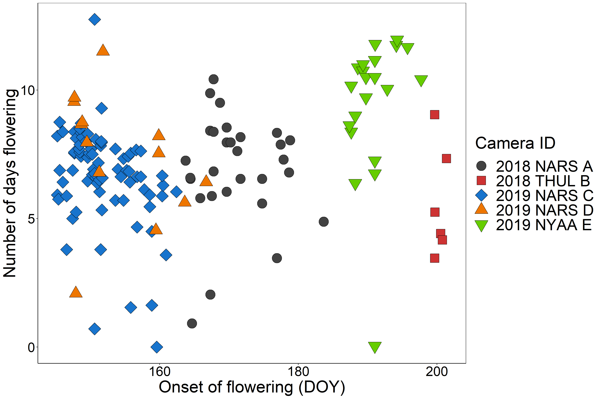
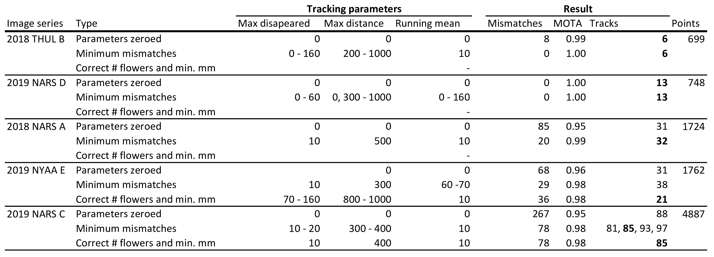
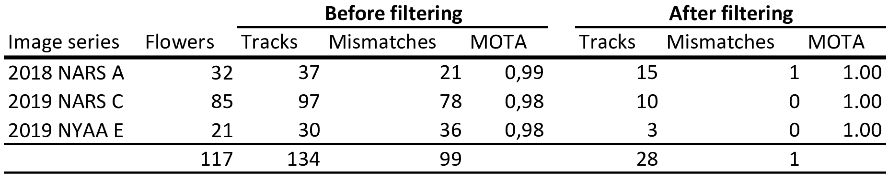
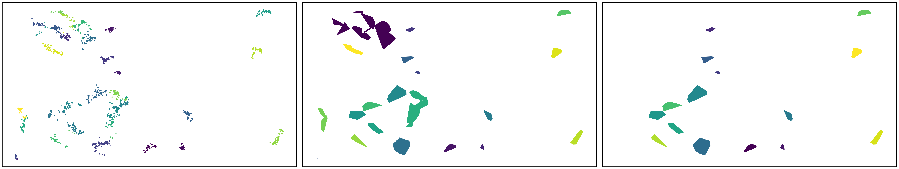
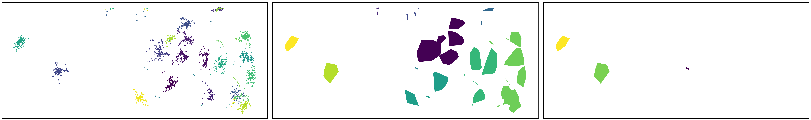

Title:

**Towards individual-based pollination ecology: Automatic tracking of life histories of individual flowers**

#
Authors:

Hjalte M. R. Mann^1,2^, Alexandros Iosifidis^2^, Toke T. Høye^1^

#
Author affiliations:

1: Department of Ecoscience and Arctic Research Centre, Aarhus University, C.F. Møllers Allé 4-8, 8000 Aarhus C, Denmark  
2: Department of Electrical and Computer Engineering – Signal Processing and Machine Learning, Aarhus University, Finlandsgade 22, 8200 Aarhus N, Denmark

#
Corresponding author contact information:

Hjalte Mads Rosenstand Mann  
E-mail: mann@ecos.au.dk  
Phone: +45 31178585

#
ORCID IDs:

HMRM: 0000-0002-4768-4767, AI: 0000-0003-4807-1345, TTH: 0000-0001-5387-3284

#
Keywords: 

Tracking, flowering phenology, Arctic, dryas octopetala, dryas integrifolia, ecological monitoring, life-history variation

\newpage
# Abstract

A fundamental problem in pollination ecology is that plant reproductive consequences of pollinator visits to a flower throughout its lifespan is very difficult to track. Deciphering the consequences of e.g. shifts in flower visitation rates to plant reproductive success and to identify mismatches between interacting and interdependent species such as insect-pollinated plants and pollinators throughout the season requires full-season phenology data, preferably at the level of individuals. Often simple statistics are used to describe the flowering phenology of a population of plants, e.g. onset or peak of flowering, which may fail to reveal the true dynamics in flowering and reproduction. Here we show that image-based monitoring of field plots at very high temporal resolution can return information on flowering phenology at the level of individuals. Further, we present a framework for automatically tracking, filtering, and evaluating flowers in time-lapse image series. We compare the results of automatic tracking with manual tracking. We show that performance achieved by automatic flower tracking can be reliable in obtaining individual flower phenology. Our method could facilitate fine-grained studies on plant reproductive success and is an important tool for estimating the sensitivity of plant-pollinator interactions to climate change. Supporting this paper is a publicly available web application through which users can apply the tracking and filtering methods on their own data.

\newpage

# Introduction

For the individual plant, timing of flowering is of utmost importance. Precocious flowering means that the plant has failed to exploit the whole temporal window for accumulating resources before allocating energy to flowering. Oppositely, flowering too late limits the time for reproduction before the end of the growing season [@ELZINGA2007]. Both precocious and late flowering increase the risk of frost damage to the flowers. Further, flowering may need to be synchronous with pollinator activity for successful reproduction. Flowering phenology may plastically change in response to abiotic cues in the environment, such as timing of spring, temperature, and photoperiod, but flowering phenology is partly heritable and shaped by selective forces from the abiotic and biotic environment and in any case sensitive to climate change.

Pollen limitation is a common factor limiting the reproductive success of flowering plants, but the ecological mechanisms behind pollen limitation is poorly understood, at least partly because it requires information on plant reproductive success in relation to pollinator visitation rates which is difficult to acquire in a natural setting and to a satisfactory extent. For example, pollinator visits can vary greatly in frequency during the flowering season and the degree of pollen limitation can vary even between populations in close vicinity to each other [@larson1999; @ashman2004]. 

Interactions require abundance of individuals in life-history stages in which interactions occur. Thus, interaction strength depends on overlap in phenology between individuals in these stages. Ideally, investigation of the sensitivity of interaction strength to dynamics in phenology requires quantification of phenology through the season for the species in question in order to asses both their phenology and abundance [@inouye2019; @linden2018]. If interacting and interdependent species, e.g. plants and pollinators, react to different environmental cues, or react differently to the same cues, their phenology may be desynchronized and temporal mismatches occur. Changes in flower phenology as a consequence of climate change may indirectly affect the abundance of flower-dependent species [@hoye2013] and these effects can be stronger than the direct effects of climate change [@ogilvie2017]. However, the relation between flower phenology and reproductive success is multifaceted and not simply a question of temporal overlap with pollinators. For example, @bolmgren2015 found that for an insect-pollinated plant species early flowering was associated with increased fruit-set but late flowering was associated with higher seed mass. Further, periods of resource scarcity through the season may be more important than the floral sum of the season, i.e. dynamics in resource availability above a level of sufficiency may have a weak effect on pollinator abundance while the time above this threshold has a stronger effect [@ogilvie2017].

Monitoring flower phenology at high temporal resolution is time-consuming, particularly in logistically challenging environments such as the Arctic. Consequently, flowering phenology of a population is often characterized simply by the date for onset of flowering, typically derived from weekly observations of sample plots [@Prevey2021]. Such inaccurate estimates may fail to reveal important dynamics in flowering phenology through the season. For example, different phenological factors, such as onset, peak, and end of flowering may respond differently to climate change [@cook2012] and estimation of the degree of mismatch between species may thus be sensitive to the choice of metric [@inouye2019]. A lot remains to be discovered about when and how the dynamics of pollination affects the reproductive success of flowering plants. High frequency observations of flower visits coupled with information on phenology and reproductive success at the level of individuals is required to unravel the relationship between pollinator visitation and plant reproductive success and the sensitivity of this interplay to climate.

The ideal metric for phenology depends on the topic of the question, but often the choice of onset of flowering as the variable representing phenology is based on data availability and not because it is considered the ideal metric. First events, such as onset of flowering, may in some cases be particularly ill suited for estimating sensitivity to climate change [@miller2008]. Onset of flowering represents the very extreme of the phenological distribution of a population and may be confounded with e.g. the size of the population considered. Further, for many questions, the phenology distribution of a population is required, for example to quantify resource availability through the season. However, even detailed information on phenology at the level of a population is still an aggregation of the phenological distributions of the individual members of the population for which important variation may be masked [@inouye2019]. Having at hand the full distribution of flowering phenology at the level of individuals allows to extract relevant characteristics of the distribution and test their individual sensitivities towards environmental factors, but acquiring such data requires efficient and preferably automatized methods. Automatic image-based monitoring of flowering phenology can return phenology data for specific species at very high temporal resolution (Mann et al., in review (Note: I'll update this if the paper gets accepted or remove it if not)), but phenological responses at the individual level may be indiscernible regardless of the temporal resolution of the data at population level. For example, a shortening of individual flower longevity may not be directly obvious at the population level. In fact, many research questions can only be explored on the basis of individual phenology data. For example, investigating the association between reproductive success and timing of flowering or flower longevity requires phenology data at the level of individuals. Similarly so for investigating whether flower visitation rates and/or reproductive success depends on the timing of flowering for the individual flower. Efficient and precise methods for deriving full seasonal distributions of phenology at the level of individuals is much needed.

Cameras have become an ubiquitous tool for non-invasive and efficient monitoring of natural processes [@howe2017; @glover2019], but the implementation of image-based collection of data has outpaced the development of reliable and easily implementable methods for processing and analysing the big data output from this transformation [@weinstein2018; @farley2018]. Computer vision and deep learning tools and being developed and applied for automatic processing and extraction of relevant data from these very large image sets [@willi2019;  @tabak2019] and increasingly for challenging tasks in entomology [@hoye2021], such as for fine-grained species classification [@spiesman2021] and monitoring of pollination events by detecting, identifying, and counting insects [@bjerge2021]. Collectively, the development and adoption of modern technology allows for collection and processing of ecological data at unprecedented scales. 

Here, we use stand-alone time-lapse cameras to monitor the phenology of two Arctic flowering plant species Dryas integrifolia and D. octopetala. We show that information on phenology at the level of individuals can be derived from image-based monitoring of flower phenology. We present and evaluate an automatic flower tracking and filtering algorithm. As the data extracted from time-lapse series of flower plots through season violate the assumptions of standard tracking mechanism, we base the track assignment on the minimum distance between centroids of bounding boxes and introduce three user defined parameters that can help optimise tracking performance.

For complex scenes with many flowers in close vicinity to each other there is a substantial risk of tracking errors regardless of the tracking method being used. In such cases it is preferable to extract individual high-confidence tracks from each series and ignore the remaining tracks. For this, we suggest a conservative filtering approach based on the density of tracks within the frame. The approach may remove correct tracks, but the tracks that remain will have a low risk of tracking errors, which allows for confident upscaling of the method to many series.

Our method for tracking individual flowers facilitates the possibility of assigning indicators of reproductive success and factors driving variation in seed set to the individual. For instance, it could be explored whether seed set is affected by timing and length of flowering and/or abiotic conditions such as frost events. Hereby, the long-standing question of what drives variation in reproductive success of individual flowers could be explored. By simultaneously tracking flower visits, these could be assigned to the individual flower and visitation rates per flower could be calculated per flower and related to reproductive success. Further, any information of taxonomic grouping could facilitate comparative studies on pollination effectiveness between taxonomic groups of pollinators. The possibility of automatically tracking phenology at the level of individuals will facilitate investigation of a set of yet untestable research questions and is an important contribution to the shift towards efficient and detailed monitoring of phenology.

# Material and methods
## Study site and species
This study was based on five time-lapse image-series collected at the following three Arctic sites (sampling years given in brackets): Narsarsuaq (NARS), South Greenland (2018, 2019), Thule (THUL), North-West Greenland (2018), Ny-Ålesund (NYAA), Svalbard (2019). The images were collected using time-lapse cameras (Moultrie Wingscapes TimelapseCam Pro, Moultrie Products, Birmingham Alabama, USA) permanently positioned approx. 60 cm above areas with either *Dryas integrifolia* in Narsarsuaq and Thule or *D. octopetala* in Ny-Ålesund. The white flowers of these two species are insect-pollinated and held erect above cushions of foliage. The species are native to and widespread in Asian, North American, and European Arctic and alpine regions. They are geographically separated apart from a possible hybrid zone in North-East Greenland [@philipp2003].

#
## The image series and flower annotations
Images were collected throughout the full growing seasons. While the original time-lapse frequency was higher, the basis for this study was 1-hr interval series. We limited the 1-hr image-series to the include only the flowering season and randomly randomly sampled images from each series. The number of images for each series after sampling is given in table 1. All flowers in bloom in each of these images were manually annotated using the rectangular bounding box tool in the VIA VGG annotation software [@dutta2019] and each individual flower was assigned a unique ID. These annotations constitute our ground truth tracks. The series varied substantially in the number of flowers they contained (table 1). Examples of annotated images from the 2019 NARS C series at three different times in the flowering season are given in fig. 1. Figure 2 shows the time of flowering for each individual flower and the number of days the flower was present in the images.

**Table 1:** Number of images and number of flowers for each of the five time-lapse image-series.

#
{ width=40% }

#
{ width=100% }

**Figure 1:** Examples of annotated images for 2019 NARS C. a: Onset of flowering at DOY 145; b: Peak flowering (52 annotated flowers) 6 days after onset (DOY 151); c: 6 days after peak flowering (DOY 157). Flower bounding boxes are colour coded by flower ID.

#
{ width=100% }  
**Figure 2:** Onset of flowering (DOY) and flower lifespan (days) for each individual flower in each of the five image-series.

#
## Automatic flower tracking

We built a framework for tracking, filtering, and evaluating tracking of objects in time-lapse image series. The tracking algorithm tracks objects based on distances between centroids of bounding boxes. The algorithm has a set of user-adjusted parameters that can optimize tracking accuracy. The parameters are particularly relevant for optimal tracking of objects that are constrained to a specific area such as flowers. It is important to note, however, that the tracking algorithm could be used to track any objects. The algorithm can be applied both offline (on a set of detections/annotations that have already been produced) or online (real-time tracking frame per frame). The speed of the tracking algorithm depends on the computational power available as well as the number of objects that are being tracked. The method is fast, however. Tracking of a series containing 85 objects ran at ~0.02 seconds per frame on a standard laptop.

Several issues complicate the task of tracking individual flowers through time-lapse image-series. First, stand-alone monitoring of the relatively slow process of flower development through full growing seasons (several months) requires only low frame rates. Here we used several images per day. These frame rates capture the phenology of the flowers at very high detail, but fail to capture the full movement of flowers. For example, as the wind shifts, the flower heads change direction, which in the image series happens instantaneously (i.e. between two consecutive frames) (fig. 3a). However, as they are constrained by their stalk, there is a limit to the distance they can move. With the tracking parameter **running mean**, we have the option to base the tracking on the distance between a point in the current frame and the running mean of the positions of a number of previous points in a track, taking advantage of the fact that flower move around a central point. Increasing the value for this parameter decreases the weighting of movement between individual frames.

Second, as flowers move, they may temporarily occlude the view of other flowers and flowers close to the edge of the frame may move in and out of view. This can cause a track to be lost and a new track erroneously being initiated when the flower reappears (fig. 3b). However, if a flower reappears in the same area as a flower is already being tracked after disappearing in a few frames, it is reasonable to assume that it is the same individual and not that the old flower wilted/disappeared and a new one developed. The parameter **max gap size** sets the number of frames a track can be lost before a new track is initiated for points appearing in the same area. If a given flower has not been detected in a few frames, the track will not be lost. Concurrently, this deals with potential false negatives. The counter for number of disappeared frames for a track is reset when a new point is associated with the track within the threshold.

Third, a standard centroid tracking algorithm will associate a point with a tracking based on minimum distance only, disregarding the absolute distance. As flowers are constrained in the movement, we can assume a maximum distance that will occur between points and force the initiation of tracks for points that exceed this threshold. We set this threshold with the parameter **max distance** measured as the euclidean distance in number of pixels.

#
{ width=100% }

**Figure 3:** a: Centroid tracking may produce erroneous associations when objects move between frames. Here the track initiated on the top left flower in frame t-1 would switch to the bottom right flower in frame t b: Tracking errors may occur when objects temporarily disappear from the frame. Here the top flower moves out of frame and the bottom flower would be assigned to the track of the top flower in frame t-1 Red shows centroid of bounding box in the current frame and blue shows centroid points from the previous frame.

#
### Input data for the tracking algorithm

The input data for the tracking algorithm are bounding box coordinates for each object in each frame given in the following format: frame number, x-min, y-min, x-max, y-max. Here, x-min, y-min is the top left corner of the bounding box and x-max, y-max is the bottom right corner. The bounding box centroid is calculated on the basis of these coordinates within the algorithm. Calculating tracking accuracy requires a ground truth ID for each bounding box which can be given as the sixth column. As this data structure is outputted from both manual object annotations and object detection methods using CNNs, the method can be applied on both manually and automatically derived data. Further, as the algorithm handles frames sequentially, it can be applied both offline and online.

#
### Identifying optimal user parameters

To explore the effect of the user parameters and to identify the optimal combination of parameters for our case of tracking flowers, we applied the tracking algorithm on each of the five image-series with every combination of a range of values for each parameter (3179 combinations): Values for max gap size and running mean were 0-160 with a step size of 10 and for max distance 0-1000 with a step size of 100. Note that max distance set to zero ignores the parameter altogether. We identified the setting(s) that returned the lowest number of track mismatches and compare the tracking results between optimal settings and all parameters set to zero.

#
## Filtering tracks

When deploying the automatic tracking algorithm on naive data without ground truth tracks, it is not possible to manually filter for correct tracks. Therefore, we present a conservative filtering method that extracts the most trustworthy tracks from a scene. 

We base our filtering on the distance between geometry centroids the tracks. The geometries are derived in the following way: For tracks consisting of only a single point, the coordinates of the point are used as the centroid. For tracks consisting of two points, we establish the straight line between the points and calculate the centroid of the line. For tracks consisting of three points, we establish the triangle from the points and calculate the centroid of the triangle. For tracks consisting of four points or more, we calculate the convex hull of all the points included in the track and derive the polygon from the vertices of the convex hull. Hereafter we calculate the centroid of the polygon. For tracks that contain more than two points but where the points a collinear, we establish the line through the points and calculate the centroid of the line.

The filtering is done on the geometry centroids to remove tracks in close vicinity to each other as these have a high risk of tracking mismatches. The distances between all centroid tracks are calculated (euclidean distance in number of pixels) and only tracks that have no neighbouring centroid within the filtering distance threshold are kept.

We demonstrate the filtering method on the three series for which our tracking algorithm did not return perfect results. For this, we chose a fixed combination of the tracking algorithm parameters across all three series (max gap size: 10; running mean: 10; max distance: 300). We then applied the filtering method on the three series with a range of values for the filtering distance (50-500, step size of 50) and identified the value that returned the highest sum of tracks across the three series at the lowest number of mismatches. We present the tracking accuracy before filtering and on the remaining tracks after filtering. We underline that the results presented are thus highly conservative. I.e., the approach could be optimised to extract a higher number of tracks while maintaining the number of mismatches. For example, basing the filtering on the best performing tracking parameters for each series specifically would improve the output of the tracking algorithm. Similarly, the results could be improved by fine-tuning the filtering distance threshold for each series individually. However, as our goal here was to demonstrate that our tracking and filtering method can be applied in a naive setting with fixed values for each parameter we have not included those results.

#
## Evaluating tracking performance

The optimal way of quantifying tracking performance depends on the goal of the tracking. To associate other information obtained in the images to the individual flower, for example flower visits, requires as much as possible of the track to be correct. To derive flowering length, in theory just requires correct association between the first and the last image of a flower while intermediate points can be ignored. Lastly, in some scenarios one may be interested in the number of flowers that existed in a plot, in which case the number of tracks obtained by automatic tracking should closely resemble the actual number of individuals in the series.

The commonly used multiple object tracking accuracy (MOTA) score quantifies tracking performance based on counts of tracking mismatches [@bernardin2008]. Mismatches occur when objects swap track identity because they are in close vicinity to each other or when an object periodically disappears and is assigned a new track identity when it reappears. Only the shifts in tracking identity are counted as mismatches while the number of points assigned to each track is not considered. We use three evaluation metrics: We calculate the number of mismatches and derive the MOTA score (number of mismatches in relation to the total number of points) to evaluate performance of our tracking and filtering algorithms. Finally, we compare the number of tracks identified by the automatic tracking with the true number of flowers in a series. These should ideally be equal. However, a correct number of tracks (i.e. number of tracks equal to number of objects) does not necessarily translate to correct tracking, since individual tracks can be erroneously split by the tracking algorithm and several tracks can be combined. We present the tracking performance by both the lowest number of mismatches/highest MOTA given overall and for combinations that returned a number of tracks equal to the number of flowers in the series.

#
## Tracking and filtering web application

To make the method described here easily accessible for other users, we built a web application through which the trackking and filtering method can be applied on user data. The web application is accessible through https://github.com/TECOLOGYxyz/FlowerTracking.

#
# Results

The results of the tracking parameter test are given in table 1. We present the tracking performance without the use of the three tracking parameters along with the best performance (lowest number of mismatches/highest MOTA), and the best performance where the number of tracks correspond to the number of individual flowers in the series. When several values for a parameter was included in a result, we present the range of values. For two series, 2018 THUL B and 2019 NARS D, the tracking algorithm returned perfect results for several combinations of parameters. For the three remaining series, the algorithm returned consistently high MOTA scores (minimum 0.95). In all cases, except 2019 NARS D, where the tracking algorithm returned perfect results with all parameters zeroed, did the inclusion of the user set tracking parameters improve the tracking accuracy.

In one case, 2019 NARS C, four different numbers of tracks were returned among the parameter combinations that resulted in the lowest number of mismatches. A number of tracks equal to the number of flowers in the series were among these four. In anotehr case, 2019 NYAA E, the parameter combination that produced the highest accuracy did not return a number of tracks equal to the number of flowers in the series. However, combinations that did produce this number of tracks also returned a higher number of mismatches.

**Table 1:** Tracking performance for the automatic flower tracking algorithm for different tracking parameter combinations. Number of tracks in bold shows when the number of tracks equals the number of flowers in the series.
{ width=100% }

 shows the performance of the tracking algorithm.

The value for filtering distance that returned the highest number of tracks at the lowest number of mismatches was 350 (results for all values given in supp. table S1). The results of the filtering algorithm on the three series in which our tracking algorithm did not return perfect results are given in table 2 and the filtering process is visualised in fig. 4. Our filtering method extracted 28 tracks from the three series (2018 NARS A: 15 tracks, 1 mismatch; 2019 NARS C: 10 tracks, 0 mismatches; 2019 NYAA E: 3 tracks, 0 mismatches) with complex scenes using a fixed filtering distance value of 350 and fixed values for the tracking parameters (10, 10, 300, for running mean, max gap size, and max distance, respectively) with only a single mismatch included in the 28 tracks.

**Table 2:** Results of the filtering algorithm with a filtering distance value of 350 applied across all three series.

{ width=100% }

#
{ width=100% }
{ width=100% }
{ width=100% }

**Figure 4:** Track filtering process. Row 1, 2, and 3 is 2019 NARS C, 2018 NARS A, and 2019 NYAA E, respectively. First column shows the centroid points in the given series, coloured by the track id from the centroid tracking algorithm. Second column shows the polygons calculated from the tracks. The filtering algorithm with a distance threshold of 350 was applied to the centroids of these polygons. Third column shows the results of the filtering where all tracks that did not pass the filtering have been removed.

 
# Discussion  
## Tracking

Many tracking algorithms, such as the Simple online and real-time tracking (SORT) [@sort], use Kalman filtering to predict the future location of an object by estimating its velocity [@kalmann]. However, Kalman filtering assumes linear motion of the object and does not handle abrupt motion well. As the flowers are constrained in movement by their stalk, their movement does not follow the assumption of linear motion. Some tracking algorithms, such as DeepSORT [@deepsort2017], take the tracking-by-detection approach in which convolutional neural networks are applied to leverage appearance information in order to continuously distinguish individuals through time, thus aiding the tracking algorithm. In our case, however, flowers are not clearly distinguishable and one flower may look less alike between two frames than two flowers in a single frame. Finally, some tracking methods require manual initiation of a fixed number of tracks for objects in the first frame and the algorithm will track these objects in the subsequent frames [@hu2012]. These methods does not allow new objects to enter the frame through the series. In our case, objects can disappear permanently from the frame, for example when flowers wilt, in which case the track should be terminated. Oppositely, new objects can continuously appear through the series when new flowers bloom of previously unseen flowers enter the frame. Additionally, objects may temporarily disappear from view and may or may not reappear at some later stage. These settings vastly complicate the task of tracking multiple objects. Our tracking algorithm returned consistently accuracy despite the difficult settings.

We applied our tracking algorithm on 3179 combinations of the three parameters. Using the parameters increased the performance of the tracking substantially. Our steps in parameter values were crude, however, and it is very likely that finer steps in these values would identify combinations that produce even better results. Here we do not perform this analysis, however, as our goal is to show that the parameters can be used for optimizing tracking performance in general

In a naive setting, a priori knowledge about which settings to use is not available. As with any tracking method, accuracy can only be assessed based on visual observation or more thoroughly by testing on subset of tracks for which a ground truth exists. When applying the method in a new setting, we recommend performing a parameter test as demonstrated here on a subset of ground truth tracks to derive the optimal set of parameters.

Number of tracks equal to number of flowers does not necessarily mean that the tracking is correct. I.e., the tracking algorithm could split one ground truth track in two, but combine two other ground truth tracks into one, which would even each other out. This was the case for NYAA-04 for which the parameter combination that returned a number of tracks equal to the number of flowers in the series was not the combination the produced the highest MOTA score.

The two series for which the tracking algorithm produced perfect results were also the series with the lowest number of flowers. As the number of flowers increase so does the complexity of the task of tracking. A higher number of flowers within the frame increases the possibility of flowers in close vicinity to each other and of flowers overlapping and moving in and out of frame translating to a higher risk of making tracking errors. The very high complexity in the scenes with many flowers, especially 2019 NARS C with 85 flowers, renders it unlikely that any tracking method could produce perfect results. Although this setting can be considered an extreme case for our application, it underlines the relevance of a pipeline including both tracking and filtering.

#
## Filtering

We presented a filtering method based on the distance between track geometry centroids which can be applied subsequent of tracking. The filtering algorithm successfully extracted correctly tracked flowers from each of the three series for which the tracking algorithm did not produce perfect results. Only a single mismatch was included in the 28 flowers that passed the filtering. Extracting tracks that are spatially isolated does not guarantee that the tracks are correct/without errors. However, as spatially isolated objects are easier to track, it increases confidence in the remaining tracks.

We applied the filtering algorithm on tracks produced with a fixed set of tracking parameters as well as a fixed value for the filtering distance. We note that the results could be improved (i.e. more flowers extracted without increased number of mismatches) by chosing the best tracking result for each series and fine-tuning the filtering distance value for each individual series. However, as our goal here was to show that a single conservative value can be applied across series for which the tracking algorithm did not necessarily produce the best results, we do not show those results here. As in the case of the tracking parameters, we recommend setting the value for the filtering distance based on either visual examination of results or on tests on a subset of ground truth data when applying the method in a new setting.

We note that our method for filtering tracks using track geometry centroids ensures that all tracks, despite the number of points in the track, are given the same weighting in the filtering since each track is represented by a single point. In some cases this may be suboptimal. For example, if it is given a priori that an object will always appear in a minimum of two frames, then single point tracks can be filtered out. However, when such a priori knowledge is not accessible, a conservative approach as the one we present is preferable.

Filtering based on geometry centroids ensures that the same weight is put on all tracks despite the number of points within the track. Additionally, it allows for overlap between track geometries as long as the distance between the track centroids is above the threshold.

#
## User-defined parameters

Our method relies on a number of parameters set by the user, both for tracking and subsequent filtering. Our results demonstrate that the tracking accuracy is sensitive to these parameters and an optimal combination of parameters can improve results substantially. Below we discuss the underlying mechanisms of each of the parameters.

For the three series with complex scenes, applying the max gap size parameter improved tracking accuracy with values of 10-20 being optimal. These series all contain flowers at the edge of the frame and the higher number of flowers increases the risk of flowers temporarily occluding others. Correct tracking of these objects requires that an object can disappear from view without the track instantly being lost, which the max gap size allows. Oppositely, a higher number of flowers also increase the possibility of a new flower blooming in close vicinity to where a flower previously existed and setting the value too high may force objects such objects that are only separated in time but occur in the same space into the same track.

In all cases, except 2019 NARS D, for which perfect tracking was achieved with all parameters set to zero, did a value for running mean above 0 improve results. Interestingly, a value of 10 produced the best results in all these cases, except for the combination returning the lowest number of mismatches for NYAA-04. Increasing the value for running mean means that less weight is put on movements between each frame. Changing the running mean to 10 while keeping the other two parameters equal only resulted in a slight increase in number of  (from 29 to 36). Thus, it is a likely explanation that the improved accuracy from the large value for running mean stems from slightly better tracking of flowers that moved a lot.

For the three series for which the tracking algorithm did not produce perfect results, the optimal range for max distance were relatively narrow (300-500). The optimal value for this setting is one that is sufficiently high so that it does not force individual flowers into separate tracks because of movement between frames yet is low enough to separate any flowers into individual tracks that would otherwise have been grouped together. This explains well why the extreme values for this parameter was not included in the highest accuracy tracks.

It is important to note that the tracking parameters are not independent. For example, the distance between a point in the current frame and a point in the previous frame may not be the same as that for a point in the current frame and the mean location of the previous ten points in a track. Thus, changing the setting for running mean could influence the optimal setting for max distance. This underlines the relevance of search for an optimal combination based on ground truth data. In general, the optimal settings for the three tracking parameters fall into relatively narrow ranges. This strengthens the assumption that the method is generalisable and could be applied for example across many more cameras than what have been demonstrated here.

We filter out tracks with high risk of error based on distance between track geometry centroids. An alternative approach could be to filter based on overlap between polygons, but this would remove tracks with even minor overlap and put weight on tracks with many points as these cover more area. Another alternative could be to base filtering on the centroids of the points within a track (i.e. mean x and mean y). The presented method avoids weighting track geometries based on number of included points and avoids weighting the centroid coordinate based on the point coordinates within the track. We note, however, that other approached may be more suitable in other settings and applications.

#
## Input data format
We demonstrated our method on manual annotations of flowers but note that the format of the input data matches the output of deep learning object detection methods. Thus, the method can be directly applied on such data. Automatically detecting flowers would likely introduce a degree of false negatives when the detection algorithm fails to detect a present object. The flowers in our data that periodically move out of the frame or are temporarily occluded mimics false negatives. Thus, it is likely that the max gap size parameter can alleviate problems with false negatives. Automatic detection methods may also introduce false positives. These detections would be included in the tracking. Single false positives could be removed automatically while other cases may require manual quality control. Depending on the application, a low degree of false positives may not problematic. In general, the performance of a tracking algorithm depends on the quality of input data and it is advisable to optimise detection accuracy before moving to tracking. The fact that our method produced perfect tracking results in simple settings could be taken into consideration when setting up future data collection schemes.

#
## Conclusion

In this paper, we have demonstrated the potential of image-based monitoring for collecting information on flower phenology at the level of individuals. The automatic tracking and filtering pipeline presented was able to return reliable flower tracks despite settings that violate assumptions of standard tracking algorithms and complex scenes with a high number of objects that are not permanent within the series. Our results show that it is possible to collect and analyse individual flower phenology at large scale at logistically challenging sites. The presented method is a significant contribution towards automatic and efficient phenology data collection.

# Acknowledgements
?

# Data availability

The code that supports the results in this paper will be made openly available at https://github.com/TECOLOGYxyz/FlowerTracking. A publicly available web application can be accessed from the Github repository through which users can run the tracking and filtering algorithms on their own data. Raw data will be archived on https://zenodo.org/.

\newpage
# References\
  

