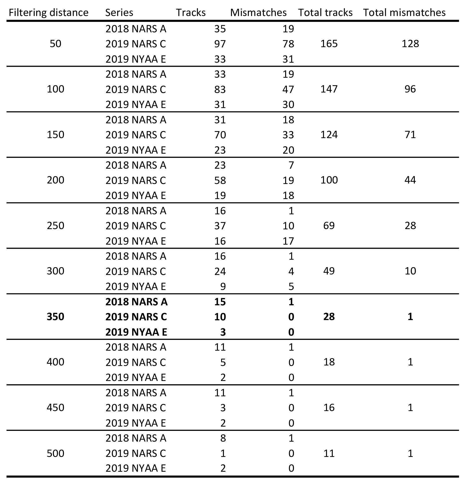

```{r eval = FALSE, echo=FALSE}
library(knitr)
knit('ManuscriptDraft.Rmd')
rmarkdown::render("SupportManuscriptDraft.Rmd", output_file = "SupportManuscriptDraft.docx")
system2("open","SupportManuscriptDraft.docx")
```

```{r echo=FALSE}
# Function for creating word comments in Rmarkdown
# Use: This text contains a `r word_comment("This is the comment", "comment.")`.

word_comment <- function(comment, highlight = "") {
  if (isTRUE(knitr:::pandoc_to() == "docx")) {
    paste0('[', comment, ']{.comment-start id="0" author="Hjalte M."',
           'date="2020-01"}', highlight, '[]{.comment-end id="0"}')
  }
}
```

\newpage

# 2

## Results of the filtering algorithm for filtering distances (eps) 50-500 with a stepsize of 50 for the three series.


eps = 50: 158 mismatches with 171 tracks kept 
eps = 100: 103 mismatches with 153 tracks kept 
eps = 150: 71 mismatches with 130 tracks kept 
eps = 200: 47 mismatches with 106 tracks kept 
eps = 250: 30 mismatches with 75 tracks kept 
eps = 300: 9 mismatches with 51 tracks kept 
eps = 350: 0 mismatches with 28 tracks kept 
eps = 400: 0 mismatches with 18 tracks kept 
eps = 450: 0 mismatches with 16 tracks kept 
eps = 500: 0 mismatches with 11 tracks kept


#{width="100%"}
